# 数据库的创建
1.大致分配：

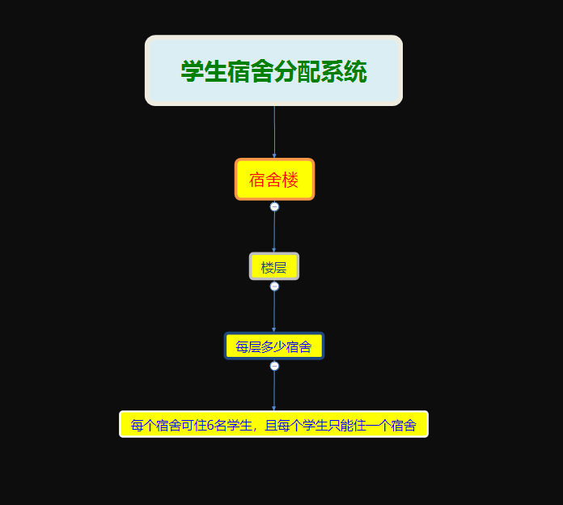

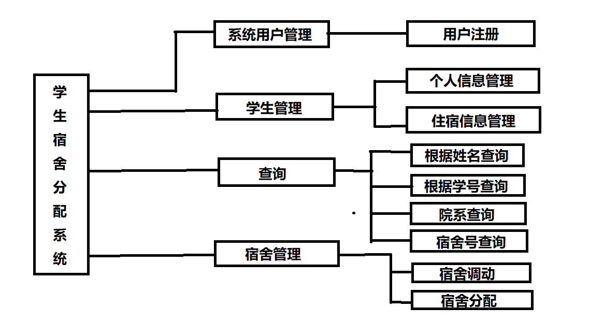

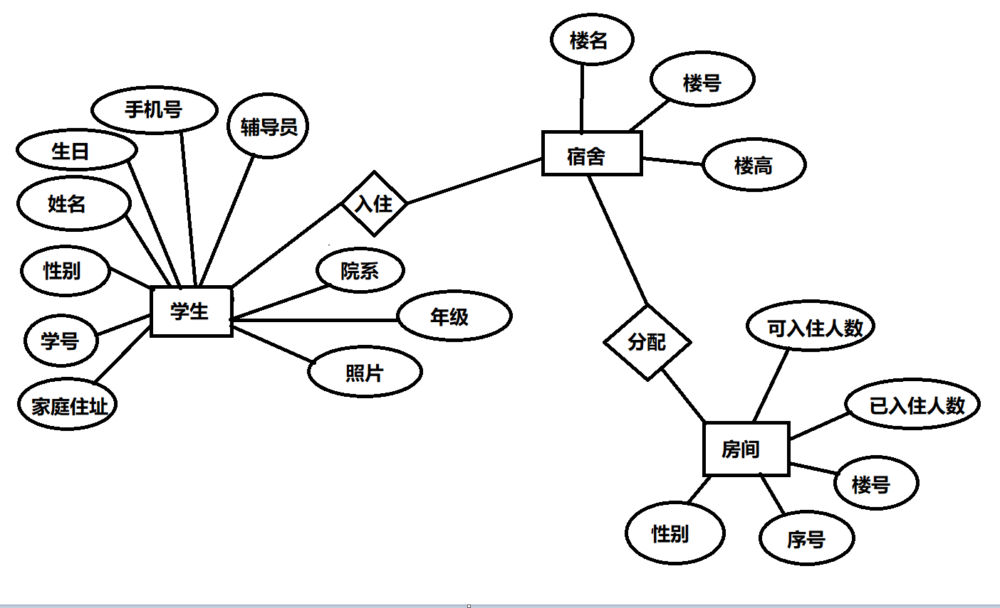

三栋楼，四个学院，女生住柳湾，男生住景槐和北泉。
新建一个**数据库ssds**，其数据库表的创建，如下所示：

---

## floor - 宿舍楼表

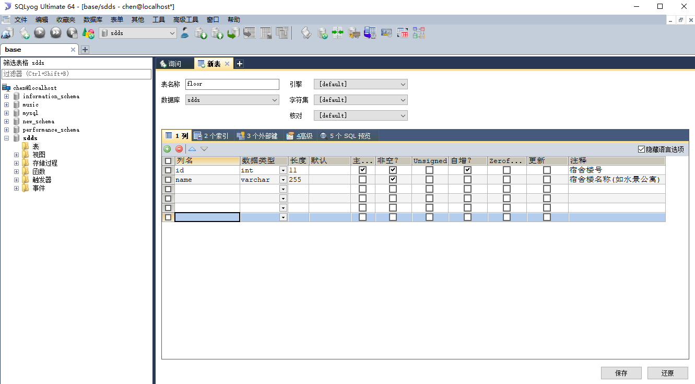

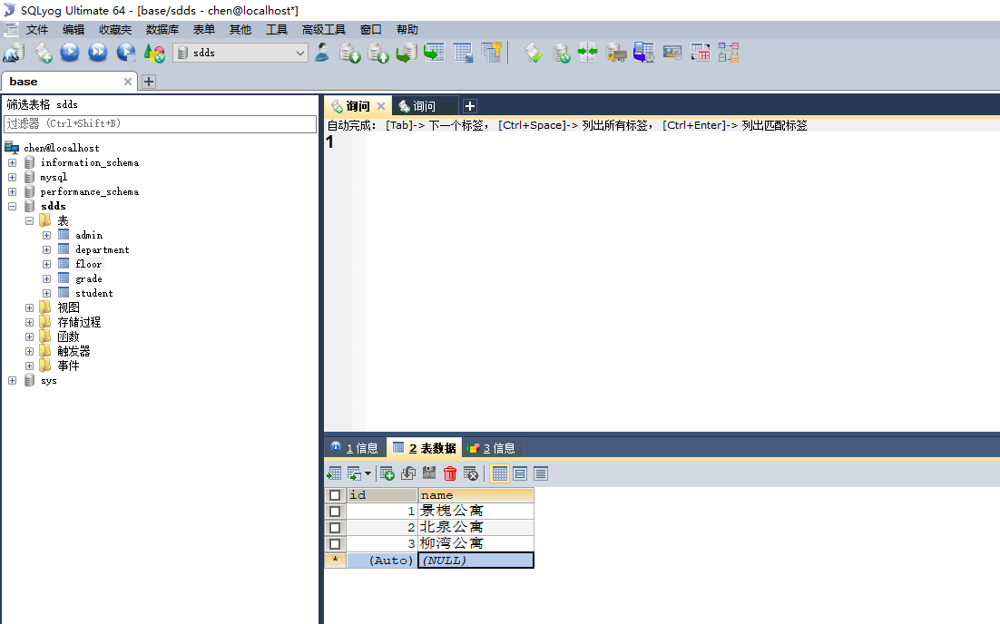

## student - 学生表

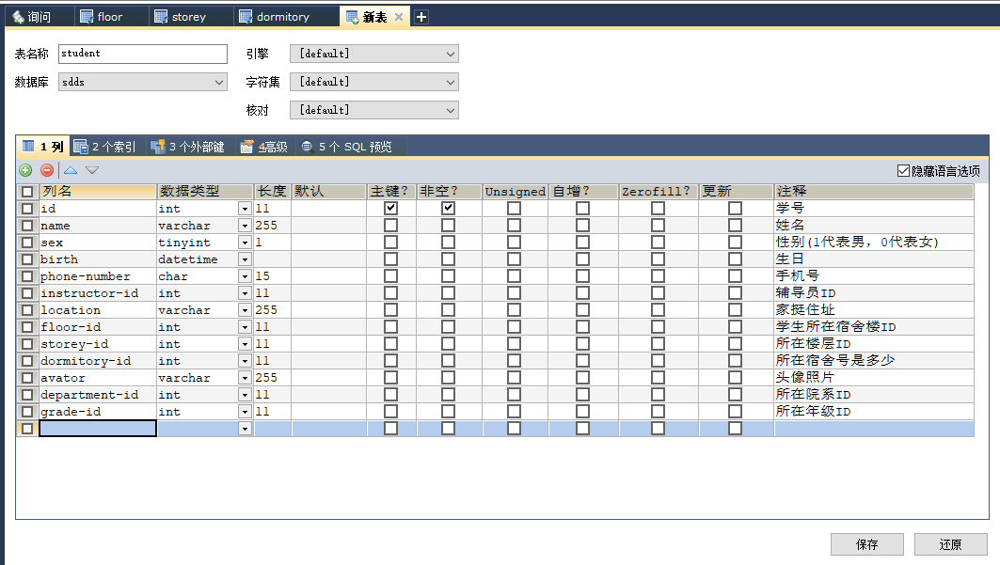

## department - 院系表

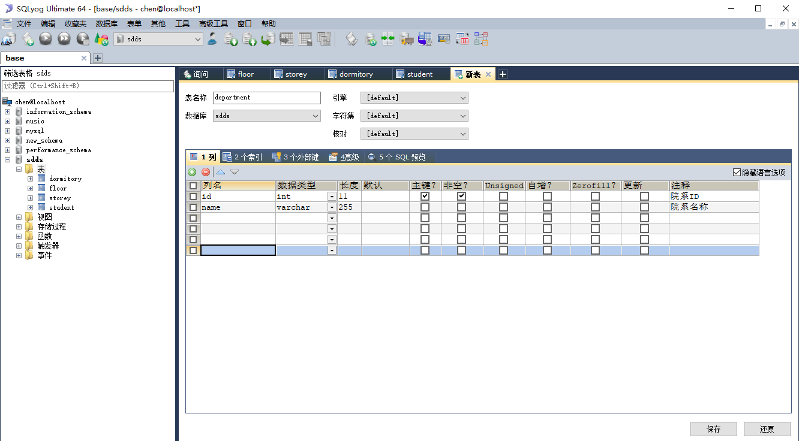

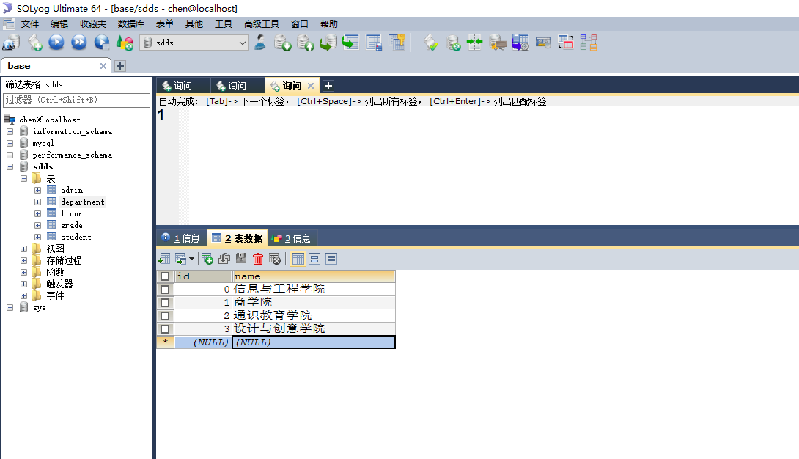

## grade - 年级表

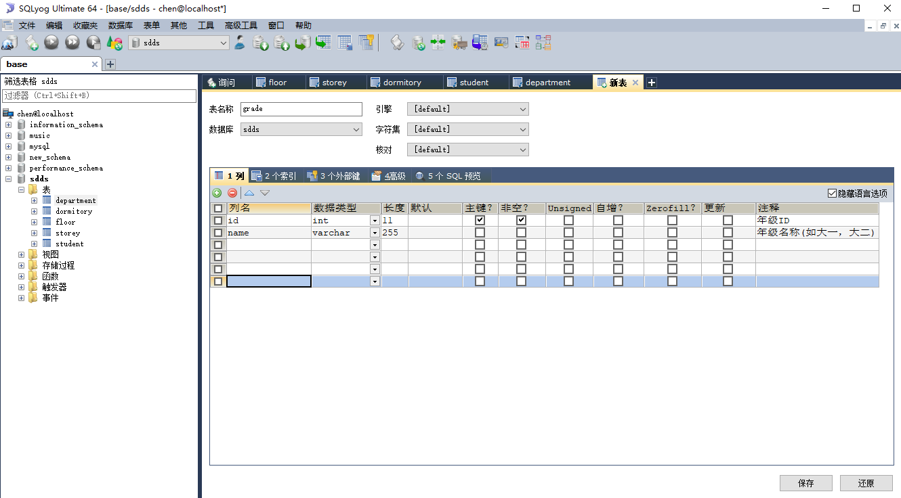

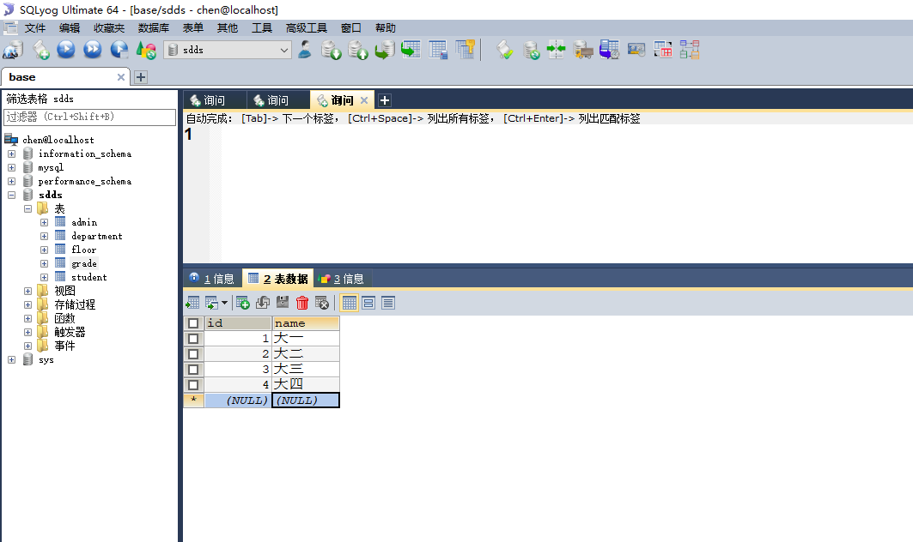

## admin - 用户登录表

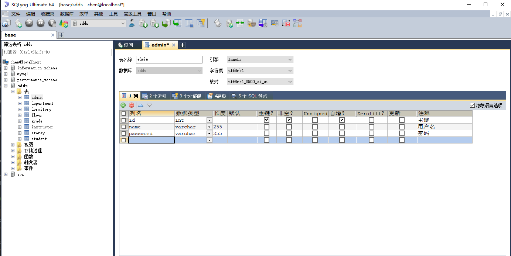

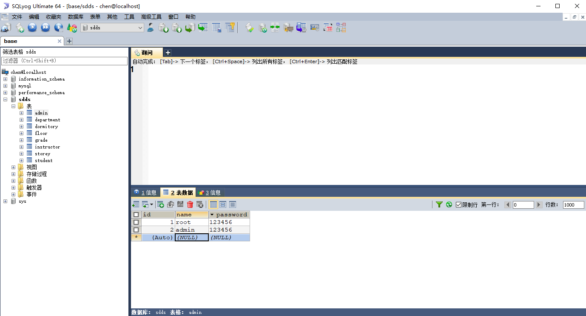

# 搭建SpringBoot环境
## 项目结构图

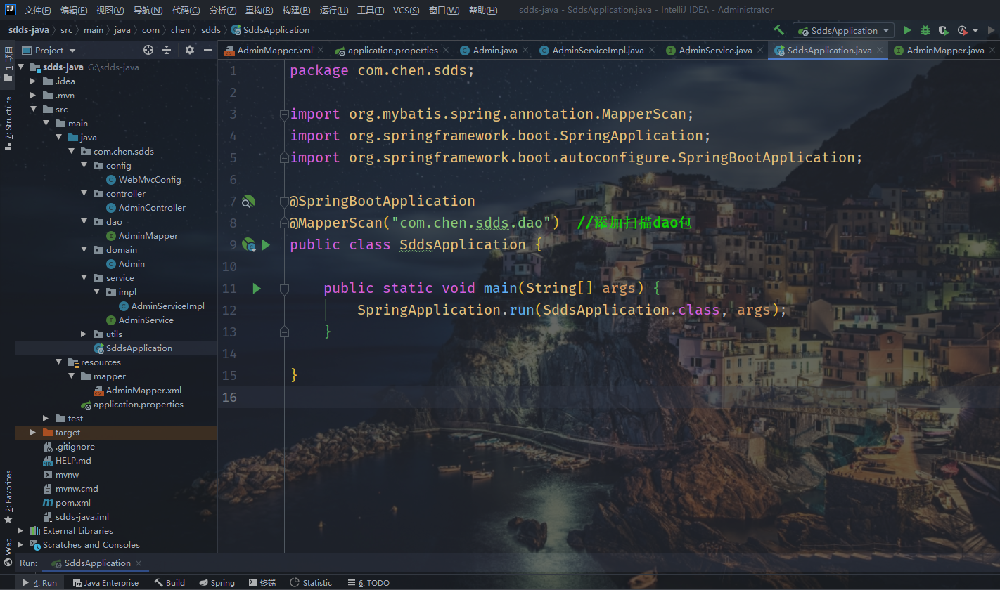

## 基本配置
1.修改pom.xml文件，添加一些依赖，如下所示：

~~~xml
<dependency>
    <!--web依赖：如tomcat,dispatcherServlet，xml...-->
    <!-- web场景启动器 -->
    <groupId>org.springframework.boot</groupId>
    <artifactId>spring-boot-starter-web</artifactId>
</dependency>

<dependency>
    <!--引入JDBC源-->
    <groupId>org.springframework.boot</groupId>
    <artifactId>spring-boot-starter-jdbc</artifactId>
</dependency>

<dependency>
    <!--引入号称JAVA的API第二个包-->
    <groupId>org.apache.commons</groupId>
    <artifactId>commons-lang3</artifactId>
</dependency>

<dependency>
    <!--处理json数据传输-->
    <groupId>com.alibaba</groupId>
    <artifactId>fastjson</artifactId>
    <version>1.2.47</version>
</dependency>

<dependency>
    <!--添加阿里巴巴的druid工具源-->
    <groupId>com.alibaba</groupId>
    <artifactId>druid</artifactId>
    <version>1.1.10</version>
</dependency>
~~~

2.修改pom.xml文件，开启热加载（改完代码后按ALT+F9即可热更新，热加载），如下所示：

~~~xml

<!--修改xml文件中的plugin标签下的内容-->
<project>
    <!--
        ......
    -->

    <build>
        <plugins>
            <plugin>
                <groupId>org.springframework.boot</groupId>
                <artifactId>spring-boot-maven-plugin</artifactId>
                <configuration> <!--使配置生效-->
                    <executable>true</executable>
                    <fork>true</fork> <!--能让热加载生效的条件之一-->
                </configuration>
            </plugin>
        </plugins>
    </build>

</project>

~~~

3.在**application.properties**这个配置文件中对项目进行一些基础配置（如设置端口号等操作）。

~~~properties
#设置端口号
server.port= 8888
#设置数据源
spring.datasource.url=jdbc:mysql://localhost:3306/sdds?serverTimezone=Asia/Shanghai&useUnicode=true&characterEncoding=utf8&useSSL=false
spring.datasource.username=chen
spring.datasource.password=123456
spring.datasource.driver-class-name=com.mysql.cj.jdbc.Driver
#数据源类型，使用阿里巴巴的DruidDataSource
spring.datasource.type=com.alibaba.druid.pool.DruidDataSource

spring.jackson.date-format=yyy-MM-dd HH:mm:ss
spring.jackson.time-zone=GMT+8

mybatis.type-aliases-package=com.chen.sdds.domain
mybatis.mapper-locations=classpath:mapper/*.xml
~~~

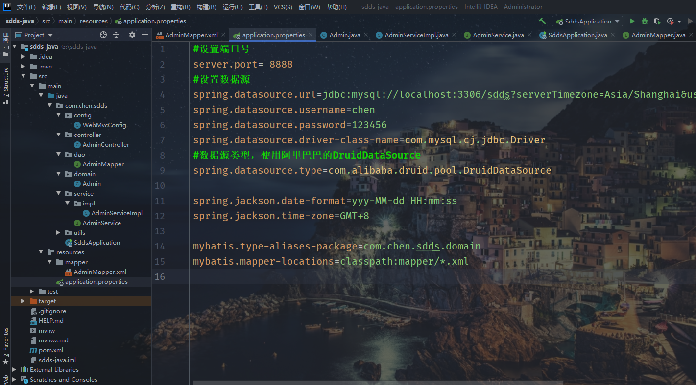

## 登录功能实现
1.在项目中新建项目所必须的包，它们分别是**config包**，**controller包**，**dao包**，**domain包**，**service包**，**impl包**，**utils包**和**mapper包**。

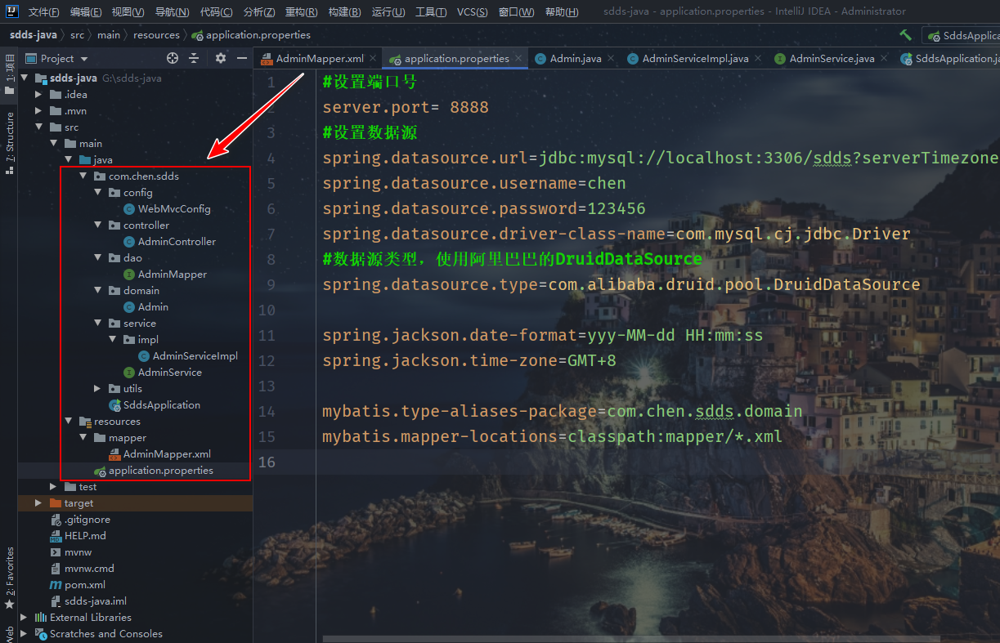

2.**config包**下的WebMvcConfig.java，如下所示：

~~~java
package com.chen.sdds.config;

import org.springframework.context.annotation.Configuration;
import org.springframework.web.servlet.config.annotation.CorsRegistry;
import org.springframework.web.servlet.config.annotation.WebMvcConfigurerAdapter;

@Configuration
public class WebMvcConfig extends WebMvcConfigurerAdapter {
    //解决跨域问题
    @Override
    public void addCorsMappings(CorsRegistry registry) {
        registry.addMapping("/**")
                .allowedOriginPatterns("*")
                .allowedMethods("*")
                .allowCredentials(true).maxAge(3600); //true表示访问的时候需要验证

    }
}
~~~

3.**controller包**下的AdminController.java，如下所示：

~~~java
package com.chen.sdds.controller;
import com.alibaba.fastjson.JSONObject;
import com.chen.sdds.service.AdminService;
import com.chen.sdds.utils.Consts;
import org.springframework.beans.factory.annotation.Autowired;
import org.springframework.web.bind.annotation.RequestMapping;
import org.springframework.web.bind.annotation.RequestMethod;
import org.springframework.web.bind.annotation.RestController;

import javax.servlet.http.HttpServletRequest;
import javax.servlet.http.HttpSession;
/*
 *控制层
 */
@RestController
public class AdminController {
    @Autowired
    private AdminService adminService;

    /*
     * 判断是否登录成功
     * */
    @RequestMapping(value = "/admin/login/status",method = RequestMethod.POST)
    public Object loginStatus(HttpServletRequest request, HttpSession session){
        JSONObject jsonObject = new JSONObject();
        String name = request.getParameter("name");
        String password = request.getParameter("password");
        boolean flag = adminService.verifyPassword(name,password);
        if (flag){
            jsonObject.put(Consts.CODE,1);
            jsonObject.put("msg","登录成功");
            session.setAttribute(Consts.NAME,name);
            return jsonObject;
        }
        jsonObject.put(Consts.CODE,0);
        jsonObject.put("msg","用户名或密码错误");
        return jsonObject;
    }

}
~~~

4.**dao包**下的AdminMapper.java接口，如下所示：

~~~java
package com.chen.sdds.dao;
import org.springframework.stereotype.Repository;

/*
 * 管理员Dao，数据访问层
 * */
@Repository
public interface AdminMapper {
    /*
     * 验证密码是否正确
     * */
    int verifyPassword(String username, String password);
}
~~~

5.**domain包**下的Admin.java，如下所示：

~~~java
package com.chen.sdds.domain;
import java.io.Serializable;

/*
 * 管理员
 * */
public class Admin implements Serializable { //实现序列化
    /*主键*/
    private Integer id;
    private String name;
    private String password;

    public Integer getId() {
        return id;
    }

    public void setId(Integer id) {
        this.id = id;
    }

    public String getName() {
        return name;
    }

    public void setName(String name) {
        this.name = name;
    }

    public String getPassword() {
        return password;
    }

    public void setPassword(String password) {
        this.password = password;
    }
}
~~~

6.**service包**的**impl包**下的AdminServiceImpl.java，如下所示：

~~~java
package com.chen.sdds.service.impl;
import com.chen.sdds.dao.AdminMapper;
import com.chen.sdds.service.AdminService;
import org.springframework.beans.factory.annotation.Autowired;
import org.springframework.stereotype.Service;

/*
 * 管理员service实现类
 * */
@Service
public class AdminServiceImpl implements AdminService {

    @Autowired
    private AdminMapper adminMapper;
    /*
     * 验证密码是否正确
     * */
    @Override
    public boolean verifyPassword(String username, String password) {
        return adminMapper.verifyPassword(username,password)>0; //大于0则返回True
    }

}
~~~

7.**utils包**下的Consts.java，如下所示：

~~~java
package com.chen.sdds.utils;
/*
 * 常量
 * */
public class Consts {
    /*
     * 登录名
     * */
    public static final String NAME = "name";

    /*
     * 返回码
     * */
    public static final String CODE = "code";

    /*
     * 返回信息
     * */
    public static final String MSG = "msg";
}
~~~

8.**mapper包**下的AdminMapper.xml，如下所示：

~~~xml
<?xml version="1.0" encoding="UTF-8"?>
<!DOCTYPE mapper PUBLIC
        "-//mybatis.org//DTD Mapper 3.0//EN"
        "http://mybatis.org/dtd/mybatis-3-mapper.dtd">
<mapper namespace="com.chen.sdds.dao.AdminMapper">
    <resultMap id="BaseResultMap" type="com.chen.sdds.domain.Admin" >
        <id column="id" jdbcType="INTEGER" property="id"/>
        <result column="name" jdbcType="VARCHAR" property="name"/>
        <result column="password" jdbcType="VARCHAR" property="password"/>
    </resultMap>

    <select id="verifyPassword" resultType="java.lang.Integer">
        select count(*) from admin where name=#{username} and password=#{password}
    </select>
</mapper>
~~~

9.还有一个是**service包**下的AdminService.java接口。

~~~java
package com.chen.sdds.service;

/*
 * 管理员service接口，业务层
 * */
public interface AdminService {
    /*
     * 验证密码是否正确
     * */
    public boolean verifyPassword(String username,String password);
}
~~~

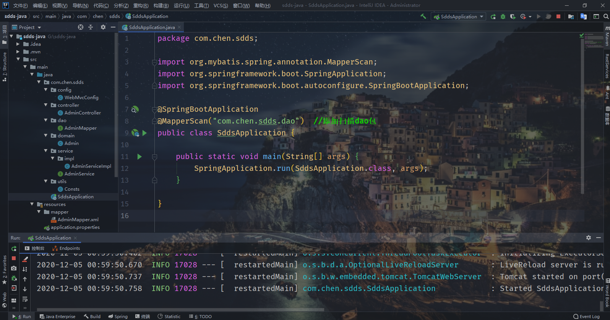

# 安装Vue CLI脚手架
1.使用以下命令安装**Vue CLI 4.x**这个新的包：

~~~python
# 使用代理registry将npm的仓库地址改为淘宝镜像，解决npm install vue/cli卡住
npm config set registry https://registry.npm.taobao.org --global

#安装cli命令如下所示
npm install -g @vue/cli
# 或者
yarn global add @vue/cli
~~~

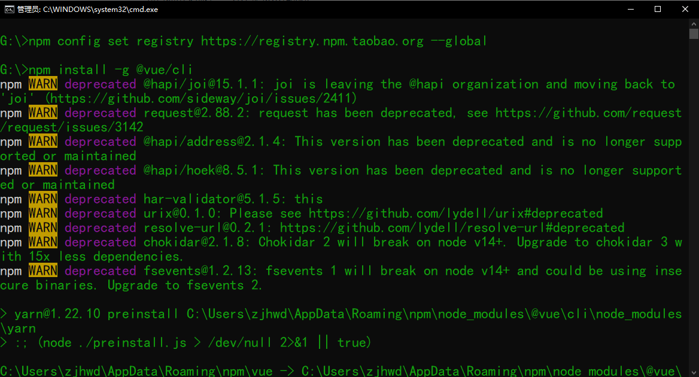

2.使用下列命令来检查安装的版本是否正确：

~~~python
vue --version
~~~

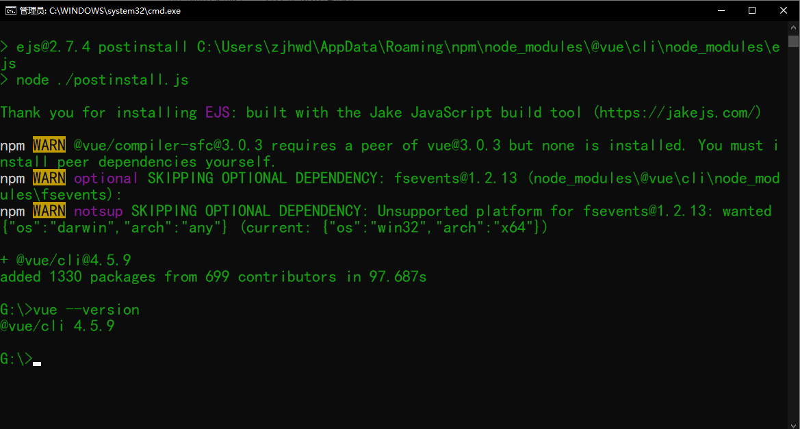

3.如需**升级全局的 Vue CLI 包**，可使用以下命令：

~~~python
npm update -g @vue/cli
# 或者
yarn global upgrade --latest @vue/cli
~~~

# 创建一个新的项目
1.运行以下命令来创建一个新项目：

~~~python
vue create sdds
~~~

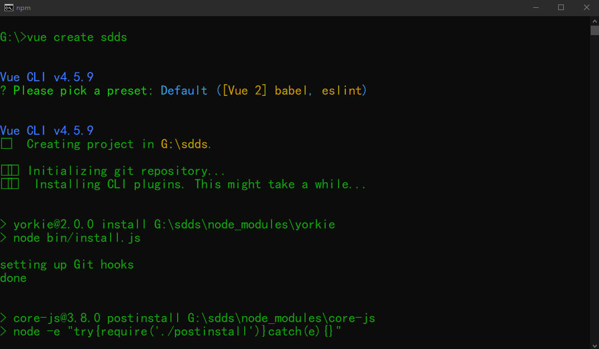

2.**Vue CLI >= 3** 和**旧版**使用了相同的 vue 命令，所以 Vue CLI 2 (vue-cli) 被覆盖了。如果仍然需要**使用旧版本的 vue init 功能**，你可以全局安装一个**桥接工具**：

~~~python
npm install -g @vue/cli-init
# `vue init` 的运行效果将会跟 `vue-cli@2.x` 相同
vue init webpack my-project
~~~

3.**进入新建的sdds项目**，然后启动新建的项目，如下所示：

~~~python
#项目安装
npm install
#启动项目
npm run serve
~~~

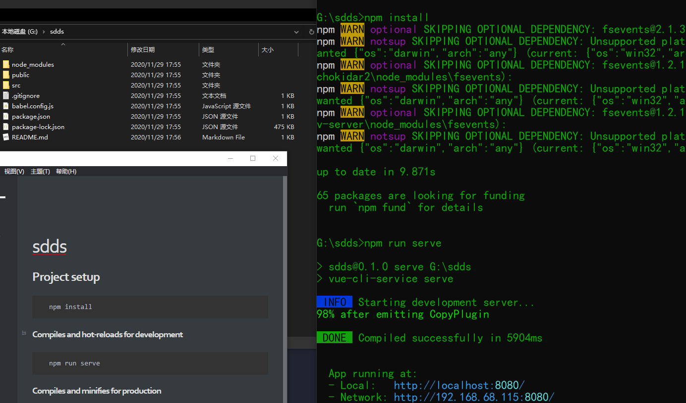

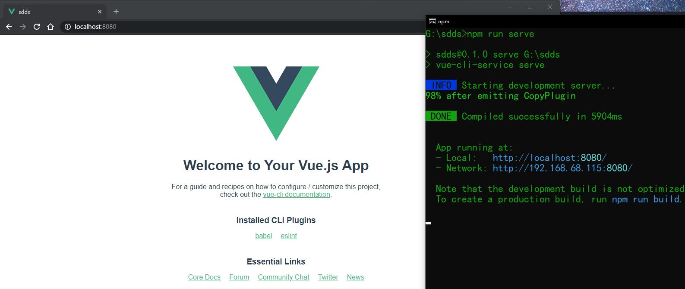

# 项目搭建配置
## 第三方插件的引入
1.导入vuex、axios、element-ui（也可以使用bootscrap等ui框架）、sass样式预处理框架，使用以下命令安装这些插件：

~~~python
'''
yarn add vuex axios element-ui font-awesome--save

yarn add node-sass  -D

yarn add sass-loader -D

yarn add style-loader -D

yarn build
'''
~~~

2.在main.js中引入相关插件，如下所示：

~~~js
import Vue from 'vue'
import App from './App'

//引入相关插件
import router from './router/index'
import store from './store/index' //引入放缓存的store
import ElementUI from 'element-ui'
import 'element-ui/lib/theme-chalk/index.css'
import './assets/css/main.css'
import 'babel-polyfill'
import VCharts from 'v-charts'

//全局注册插件
Vue.use(ElementUI)
Vue.use(VCharts)

new Vue({
  el: '#app',
  router,
  store,
  render: h => h(App)
})
~~~

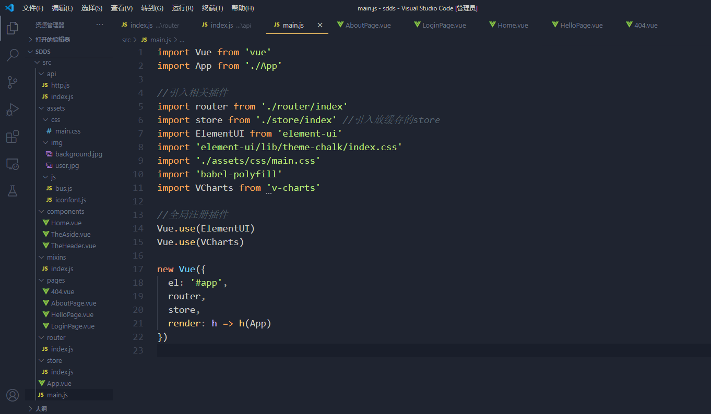

## 基本目录的创建

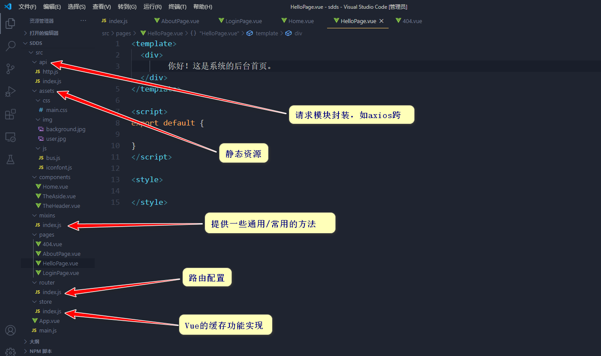

### router

修改**router的index.js文件**，要保证所有的子页面跳转都在Login页面（即登录页面第一）的框架下，路由配置如下所示：

~~~js
import Vue from 'vue'
import Router from 'vue-router'

Vue.use(Router)

export default new Router({
  routes: [
    {
      path: '/',
      component: resolve => require(['../pages/LoginPage.vue'], resolve)
    },
    {
      path: '/Home',
      component: resolve => require(['../components/Home.vue'], resolve),
      children:[
        {
          path: '/Hello',
          component: resolve => require(['../pages/HelloPage.vue'], resolve)
        },
        {
          path: '/About',
          component: resolve => require(['../pages/AboutPage.vue'], resolve)
        },
        {
          path: '/404',
          component: resolve => require(['../pages/404.vue'], resolve)
        }, 
      ]  
    }

  ]
})
~~~

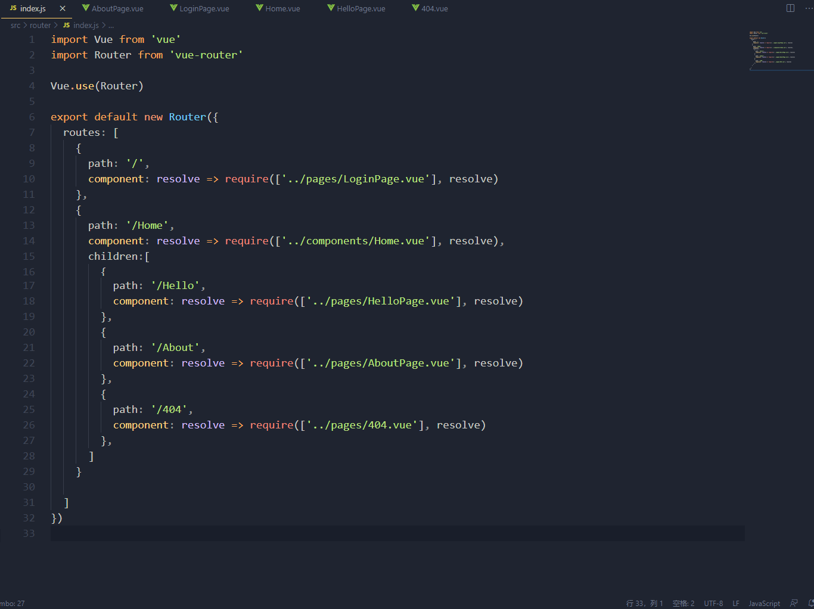

### mixins
修改**router的index.js文件**，里面回放一些常用的方法实现，如下所示：

~~~js
export const mixin = {
    methods:{
        //提示信息
        notify(title,type){
            this.$notify({
                title: title,
                type: type
            })
        },
    }
}
~~~

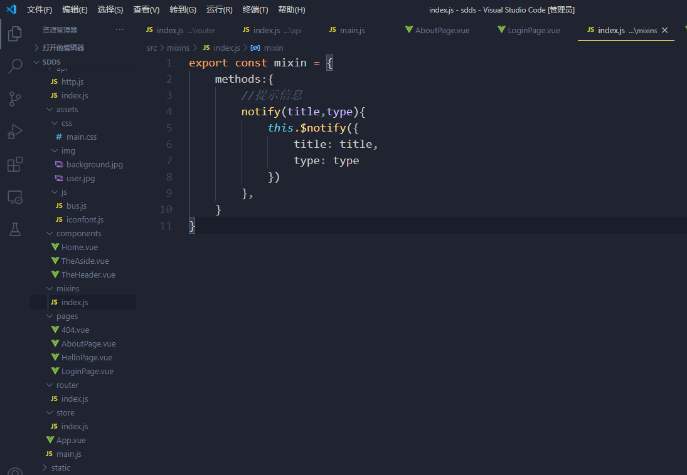

### store
Vue缓存功能的实现，修改**store的index.js文件**，如下所示:

~~~js
import Vue from 'vue'
import Vuex from 'vuex'
Vue.use(Vuex)

//放缓存数据
const store = new Vuex.Store({
    state:{
        HOST: 'http://127.0.0.1:8888'
    }
})

export default store    //导出去
~~~

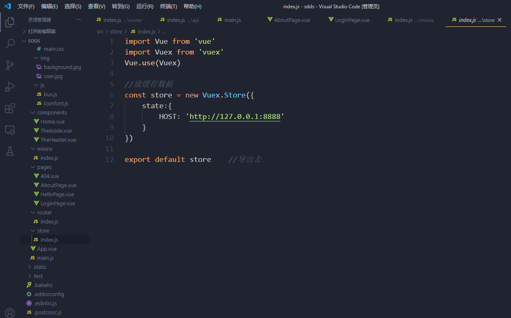

### App.vue
**App.vue**文件内容如下所示：

~~~html
<template>
  

    <router-view></router-view>
  

</template>

~~~

### 跨域axios
1.第一步：编写sdds -> src -> api下http.js文件。

~~~js
import axios from 'axios';
import VueRouter from 'vue-router';
axios.defaults.timeout = 5000; //超时时间是5秒
axios.defaults.withCredentials = true; //允许跨域
//Content-type 响应头
axios.defaults.headers.post['Content-Type']='application/x-www-form-urlencoded;charset=UTF-8';
//基础url
axios.defaults.baseURL = "http://localhost:8888";
//响应拦截器
axios.interceptors.response.use(
    response => {
        //如果response里面的status是200，说明接口访问正确
        if(response.status == 200){
            return Promise.resolve(response); //让程序继续执行
        }else{
            return Promise.reject(response); //让程序停止执行
        }
    },
    error => { //即404
        if(error.response.status){
            switch(error.response.status){
                case 401:   //未登录
                    VueRouter.replace({
                        path:'/',
                        query:{
                            redirect: router.currentRoute.fullPath
                        }
                    });
                    break;
                case 404:  //资源没找到
                    break;
            }
            return Promise.reject(error.response);
        }
    }
);

/*
 *封装get方法
 */ 
export function get(url,params={}){
    return new Promise((resolve,reject) => {    //异步访问
        axios.get(url,{params:params})
        .then(response =>{
            resolve(response.data);
        }) //正常
        .catch(err => { //异常
        reject(err);
        })
    });
}

/*
 *封装post方法
 */
export function post(url, data = {}) {
  return new Promise((resolve, reject) => { //异步访问
      axios.post(url, data)
        .then(response => {
            resolve(response.data);
        })
    }) //正常
    .catch(err => { //异常
      reject(err);
    });
}
~~~

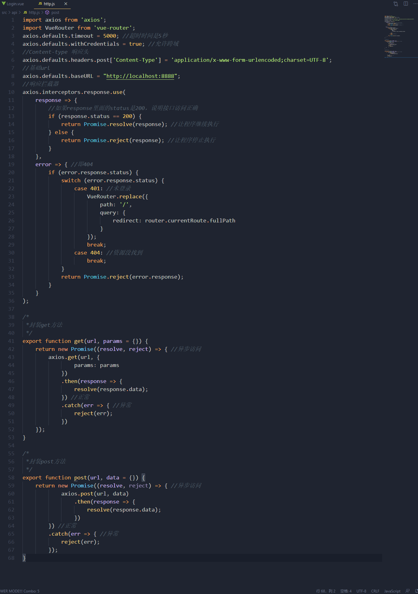

2.编写api文件夹下的index.js文件，用来使用http.js封装的get和post方法。

~~~js
import {get,post} from "./http";

//判断管理员是否登录成功
export const getLoginStatus = (params) => post(`admin/login/status`,params);
~~~

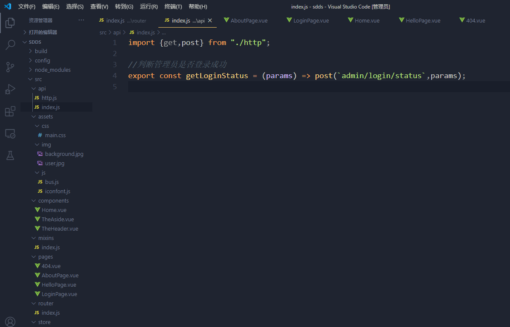

# 登录实现
## LoginPage.vue

~~~html
<template>
  

    
学生宿舍分配系统

    <!--首页登录框-->
    

      <el-form :model="ruleForm" :rules="rules" ref="ruleForm">
        <el-form-item prop="username">
          <el-input v-model="ruleForm.username" placeholder="用户名" ></el-input><!--vue的双向绑定-->
        </el-form-item>
         <el-form-item prop="password">
          <el-input type="password" v-model="ruleForm.password" placeholder="密码" ></el-input><!--vue的双向绑定-->
        </el-form-item>
        

          <el-button type="primary" @click="submitForm">登录</el-button>
        

      </el-form>
    

  

</template>

~~~

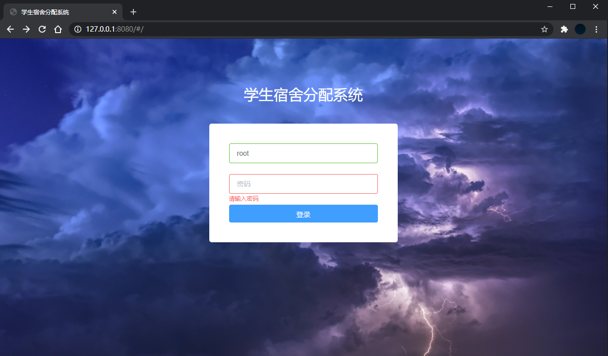

## 登录测试

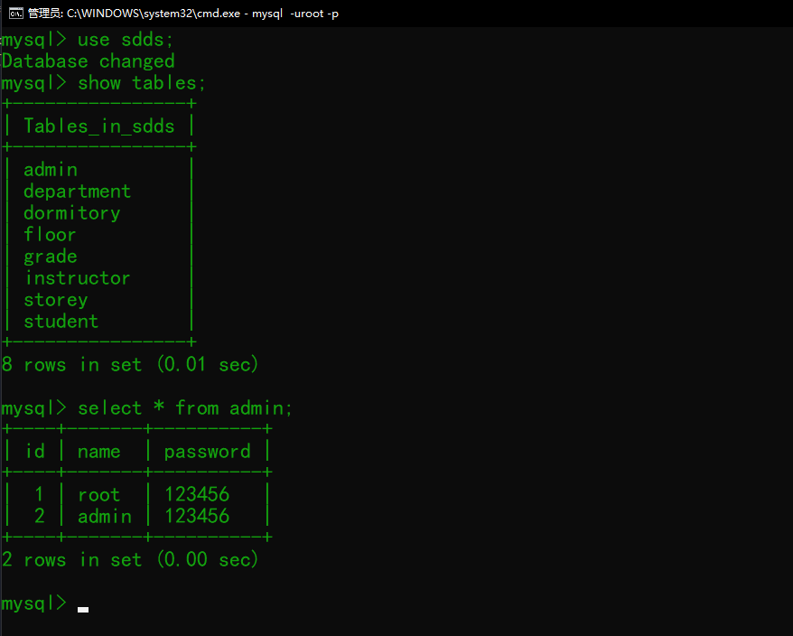

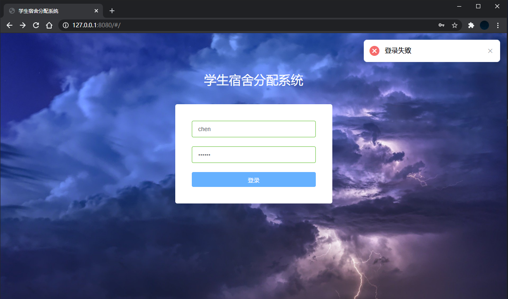

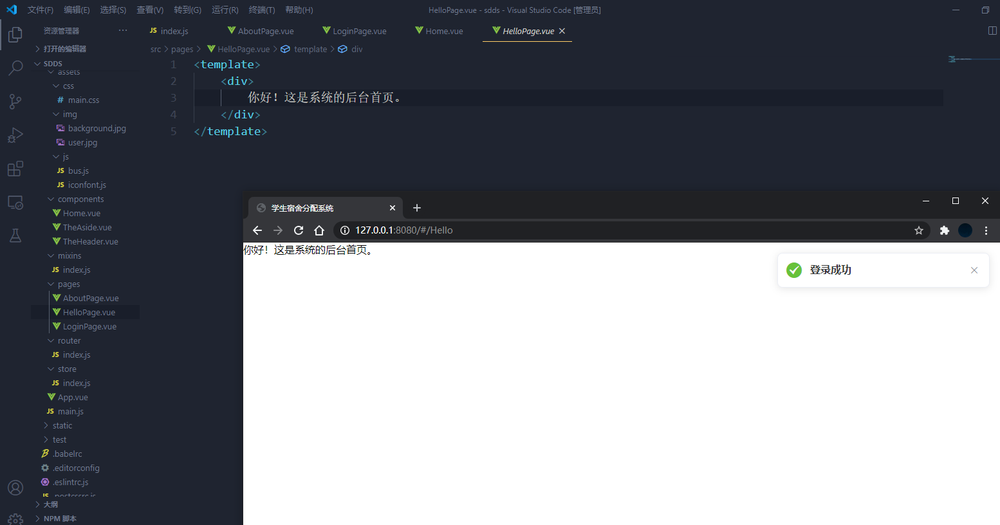

# 网站框架基本设计

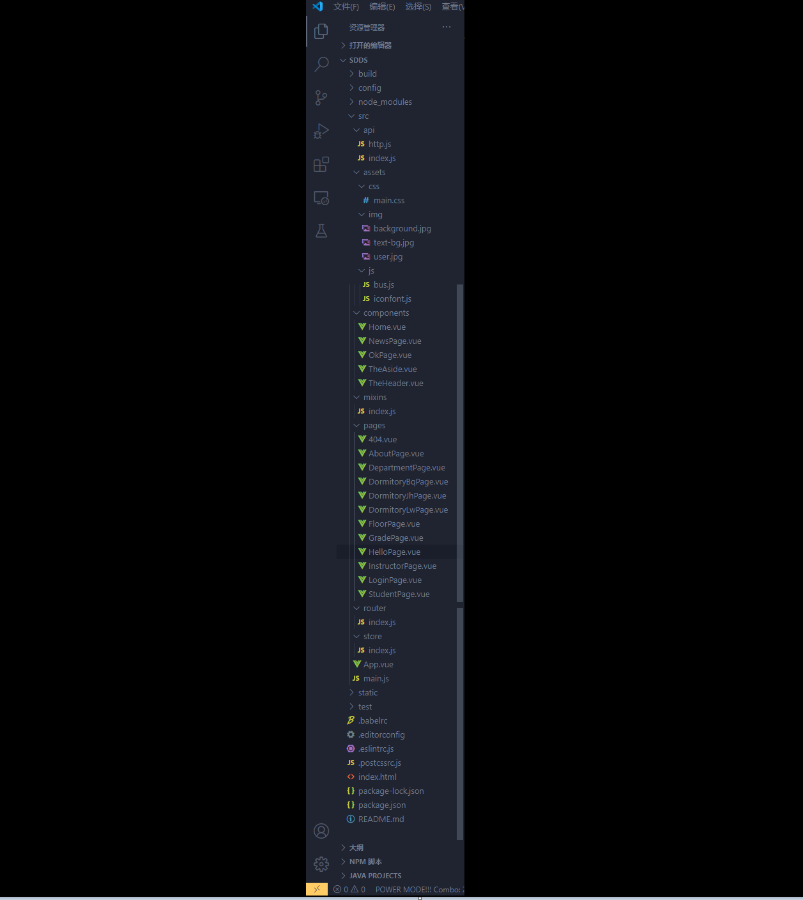

## components目录
### Home.vue

~~~html
<template>
    

        <the-header></the-header>
        <the-aside></the-aside>
        <!--添加一个div，把router-view标签包起来-->
        

                <router-view></router-view>
        

    

</template>

~~~

### TheAside.vue

~~~html
<!--页面左侧菜单-->
<template>
    

        

            

            
chendark

            生命不是要超越别人，而是要超越自己。
            

        

        <!--
            Element-ui的导航菜单：
            :default-active="onRoutes" 哪个处于被点击状态
            :collapse="collapse" 菜单的折叠属性，默认是不折叠的
            router 点击之后会进入什么页面
        -->
        <el-menu
            default-active="2"
            class="el-menu-vertical-demo"
            @open="handleOpen"
            @close="handleClose"
            background-color="#334256"
            text-color="#a7b1c2"
            active-text-color="#20a0ff"
            router
        >
        <template v-for="item in items">    <!--循环-->
            <template>
                <el-menu-item :index="item.index" :key="item.index">
                    <i class="el-icon-location"></i> <!--小图标，使用element-ui导航一的图标样式-->
                     {{item.title}} 
                </el-menu-item>
            </template>    
        </template> 
        </el-menu>
    

</template>

~~~

### TheHeader.vue

~~~html
<!--页面头部-->
<template>
    

        <!-- header左侧 -->
        

            

                <el-menu
                :default-active="activeIndex"
                class="el-menu-demo"
                mode="horizontal"
                @select="handleSelect"
                background-color="#545c64"
                text-color="#fff"
                active-text-color="#ffd04b"
                router
                >
                <el-menu-item index="Hello">首页</el-menu-item>
                <el-submenu index="2">
                    <template slot="title">宿舍楼</template>
                    <el-menu-item index="DormitoryJh">景槐公寓</el-menu-item>
                    <el-menu-item index="DormitoryBq">北泉公寓</el-menu-item>
                    <el-menu-item index="DormitoryLw">柳湾公寓</el-menu-item>
                </el-submenu>
                <el-menu-item index="News">消息中心</el-menu-item>
                <el-menu-item index="About">关于</el-menu-item>
                <el-menu-item index="Ok"><a href="https://chendark.gitee.io/" target="_blank">博客</a></el-menu-item>
                </el-menu>
            

        

        <!-- header右侧 -->
        

            <!--下拉菜单-->
            <el-dropdown class="user-name" trigger="click" @command="handleCommand"> 
                <!--用户名显示-->
                
                {{userName}}
                <i class="el-icon-caret-bottom"></i> <!--下拉小图标-->
                
                <!--下拉功能-->
                <el-dropdown-menu slot="dropdown">
                    <el-dropdown-item command="logout">退出登录</el-dropdown-item>
                </el-dropdown-menu>
            </el-dropdown>
        

    

</template>

~~~

### NewsPage.vue

~~~html
<template>
  
消息中心页面

</template>

~~~

### OkPage.vue

~~~html
<template>
  
OK页面

</template>

~~~

## pages目录
### HelloPage.vue

~~~html
<template>
  

        你好！这是系统的后台首页。
  

</template>

~~~

### StudentPage.vue

~~~html
<template>
  
学生管理页面

</template>

~~~

### InstructorPage.vue

~~~html
<template>
  
辅导员管理页面

</template>

~~~

### GradePage.vue

~~~html
<template>
  
年级管理页面

</template>

~~~

**其余都和上面一样，只是写了一个该网页的简单介绍**

## router目录配置

~~~js
import Vue from 'vue'
import Router from 'vue-router'

Vue.use(Router)

export default new Router({
  routes: [
    {
      path: '/',
      component: resolve => require(['../pages/LoginPage.vue'], resolve)
    },
    {
      path: '/Home',
      component: resolve => require(['../components/Home.vue'], resolve),
      children:[
        {
          path: '/Hello',
          component: resolve => require(['../pages/HelloPage.vue'], resolve)
        }, 
        {
          path: '/News',
          component: resolve => require(['../components/NewsPage.vue'], resolve)
        },
        {
          path: '/Ok',
          component: resolve => require(['../components/OkPage.vue'], resolve)
        },
        {
          path: '/DormitoryJh',
          component: resolve => require(['../pages/DormitoryJhPage.vue'], resolve)
        },
        {
          path: '/DormitoryBq',
          component: resolve => require(['../pages/DormitoryBqPage.vue'], resolve)
        },
        {
          path: '/DormitoryLw',
          component: resolve => require(['../pages/DormitoryLwPage.vue'], resolve)
        },
        {
          path: '/Student',
          component: resolve => require(['../pages/StudentPage.vue'], resolve)
        },
        {
          path: '/Instructor',
          component: resolve => require(['../pages/InstructorPage.vue'], resolve)
        },
        {
          path: '/Grade',
          component: resolve => require(['../pages/GradePage.vue'], resolve)
        },
        {
          path: '/Floor',
          component: resolve => require(['../pages/FloorPage.vue'], resolve)
        },
        {
          path: '/Department',
          component: resolve => require(['../pages/DepartmentPage.vue'], resolve)
        },
        {
          path: '/About',
          component: resolve => require(['../pages/AboutPage.vue'], resolve)
        },
        {
          path: '/404',
          component: resolve => require(['../pages/404.vue'], resolve)
        }, 
      ]  
    }

  ]
})
~~~

## 完成基本设计

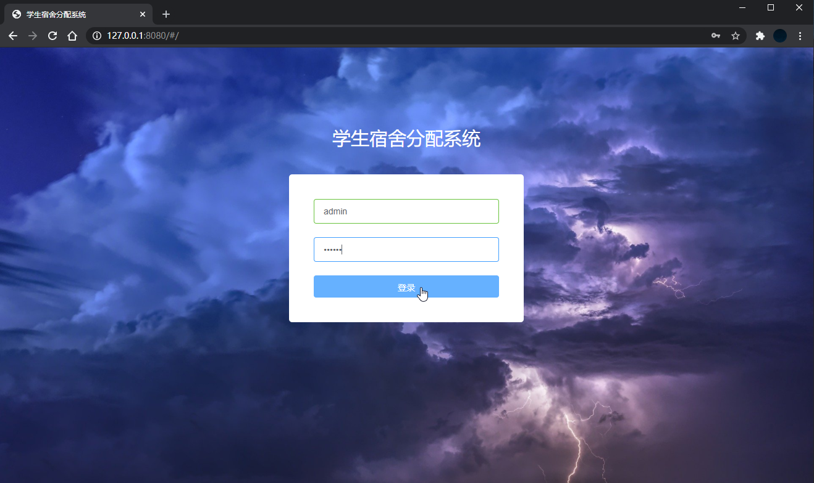

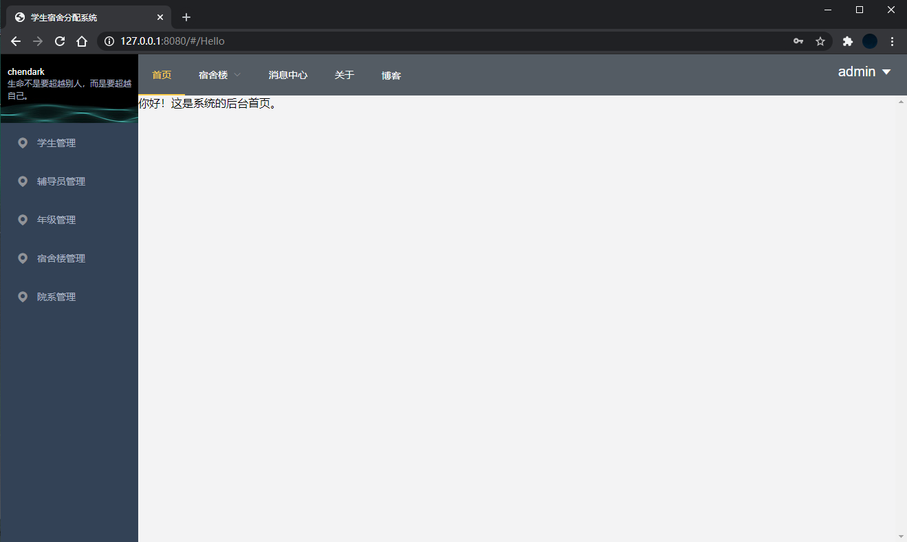

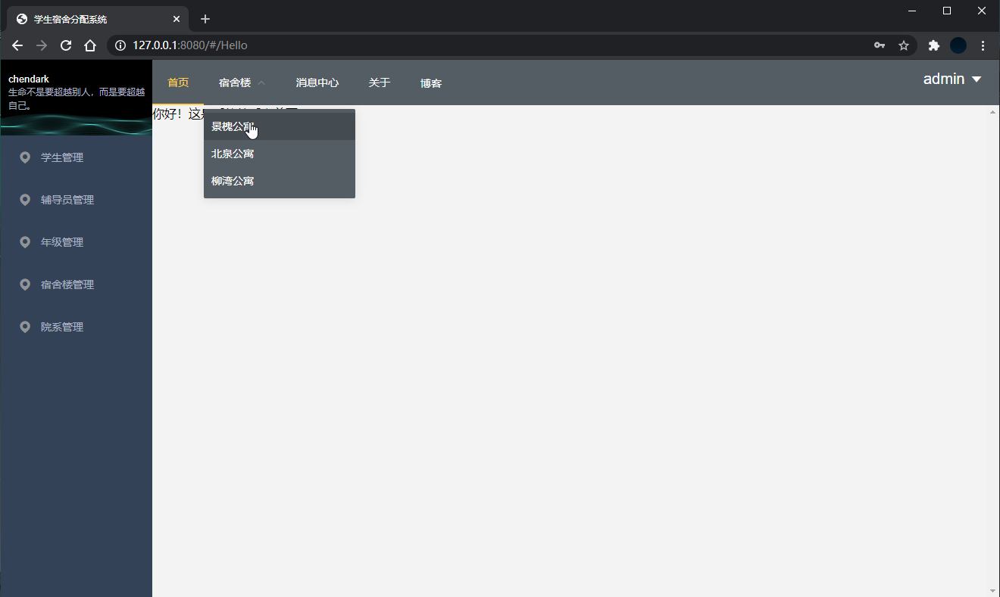

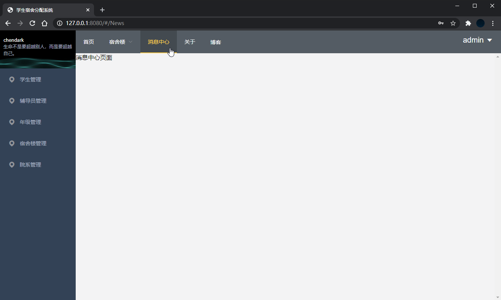

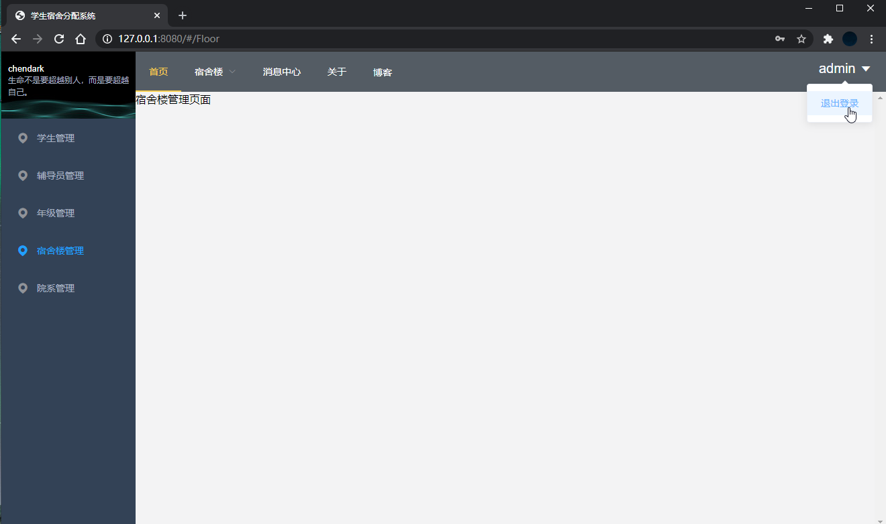

# 完善具体功能
## 学生管理页面实现
### 后端
#### domain层
打开IDEA，在domain包中新建一个Student类（即学生类），内容如下所示：

~~~java
package com.chen.sdds.domain;
import java.io.Serializable;
import java.util.Date;

/*
 * 学生类
 */
public class Student implements Serializable {  //实现序列化
    /*主键*/
    private Integer id;
    /*账号*/
    private String name;
    /*性别*/
    private Byte sex;
    /*生日*/
    private Date birth;
    /*手机号*/
    private String phone_number;
    /*辅导员ID*/
    private Integer instructor_id;
    /*家挺住址*/
    private String location;
    /*学生所在宿舍楼ID*/
    private Integer floor_id;
    /*所在宿舍号，如203*/
    private Integer dormitory_id;
    /*头像*/
    private String pic;
    /*所在院系*/
    private Integer department_id;
    /*所在年级*/
    private Integer grade_id;

    public Integer getId() {
        return id;
    }

    public void setId(Integer id) {
        this.id = id;
    }

    public String getName() {
        return name;
    }

    public void setName(String name) {
        this.name = name;
    }

    public Byte getSex() {
        return sex;
    }

    public void setSex(Byte sex) {
        this.sex = sex;
    }

    public Date getBirth() {
        return birth;
    }

    public void setBirth(Date birth) {
        this.birth = birth;
    }

    public String getPhone_number() { return phone_number; }

    public void setPhone_number(String phone_number) { this.phone_number = phone_number; }

    public Integer getInstructor_id() { return instructor_id; }

    public void setInstructor_id(Integer instructor_id) {
        this.instructor_id = instructor_id;
    }

    public String getLocation() {
        return location;
    }

    public void setLocation(String location) {
        this.location = location;
    }

    public Integer getFloor_id() {
        return floor_id;
    }

    public void setFloor_id(Integer floor_id) {
        this.floor_id = floor_id;
    }

    public Integer getDormitory_id() {
        return dormitory_id;
    }

    public void setDormitory_id(Integer dormitory_id) {
        this.dormitory_id = dormitory_id;
    }

    public String getPic() {
        return pic;
    }

    public void setPic(String avator) {
        this.pic = avator;
    }

    public Integer getDepartment_id() {
        return department_id;
    }

    public void setDepartment_id(Integer department_id) {
        this.department_id = department_id;
    }

    public Integer getGrade_id() {
        return grade_id;
    }

    public void setGrade_id(Integer grade_id) {
        this.grade_id = grade_id;
    }
}
~~~

#### dao层
打开IDEA，在dao包中新建一个StudentMapper接口（学生管理的Dao层），内容如下所示：

~~~java
package com.chen.sdds.dao;

import com.chen.sdds.domain.Student;
import org.springframework.stereotype.Repository;

import java.util.List;

/*
 * 学生Dao层
 * */
@Repository
public interface StudentMapper {
    /*
     * 增加
     * */
    public int insert(Student student);
    /*
     * 修改
     * */
    public int update(Student student);
    /*
     * 删除
     * */
    public int delete(Integer id);
    /*
     * 根据主键查询整个对象
     * */
    public Student selectById(Integer id);
    /*
     * 查询所有学生数据
     * */
    public List<Student> allStudent();
}
~~~

#### mapper.xml层
在**resources -> mapper包**中新建一个**StudentMapper.xml**，内容如下所示：

~~~xml
<?xml version="1.0" encoding="UTF-8"?>
<!DOCTYPE mapper PUBLIC
        "-//mybatis.org//DTD Mapper 3.0//EN"
        "http://mybatis.org/dtd/mybatis-3-mapper.dtd">
<mapper namespace="com.chen.sdds.dao.StudentMapper">
    <resultMap id="BaseResultMap" type="com.chen.sdds.domain.Student" >
        <id column="id" jdbcType="INTEGER" property="id"/>
        <id column="instructor_id" jdbcType="INTEGER" property="instructor_id"/>
        <id column="floor_id" jdbcType="INTEGER" property="floor_id"/>
        <id column="dormitory_id" jdbcType="INTEGER" property="dormitory_id"/>
        <id column="department_id" jdbcType="INTEGER" property="department_id"/>
        <id column="grade_id" jdbcType="INTEGER" property="grade_id"/>
        <result column="name" jdbcType="VARCHAR" property="name"/>
        <result column="sex" jdbcType="TINYINT" property="sex"/>
        <result column="birth" jdbcType="TIMESTAMP" property="birth"/>
        <result column="phone_number" jdbcType="VARCHAR" property="phone_number"/>
        <result column="location" jdbcType="VARCHAR" property="location"/>
        <result column="pic" jdbcType="VARCHAR" property="pic"/>
    </resultMap>

    <sql id="Base_Column_List">
        id,name,sex,birth,phone_number,instructor_id,location,floor_id,dormitory_id,
        pic,department_id,grade_id
    </sql>

    <!-- 增加-Begin -->
    <insert id="insert" parameterType="com.chen.sdds.domain.Student">
        insert into student
        <trim prefix="(" suffix=")" suffixOverrides=","> <!--查询结果加上“()”，并且后面去掉“,”-->
            <if test="id != null">
                id,
            </if>
            <if test="name != null">
                name,
            </if>
            <if test="sex != null">
                sex,
            </if>
            <if test="birth != null">
                birth,
            </if>
            <if test="phone_number != null">
                phone_number,
            </if>
            <if test="instructor_id != null">
                instructor_id,
            </if>
            <if test="location != null">
                location,
            </if>
            <if test="floor_id != null">
                floor_id,
            </if>
            <if test="dormitory_id != null">
                dormitory_id,
            </if>
            <if test=" pic != null">
                pic,
            </if>
            <if test="department_id != null">
                department_id,
            </if>
            <if test=" grade_id != null">
                grade_id,
            </if>
        </trim>
        <trim prefix="values (" suffix=")" suffixOverrides=",">
            <if test="id != null">
                #{id},
            </if>
            <if test="name != null">
                #{name},
            </if>
            <if test="sex != null">
                #{sex},
            </if>
            <if test="birth != null">
                #{birth},
            </if>
            <if test="phone_number != null">
                #{phone_number},
            </if>
            <if test="instructor_id != null">
                #{instructor_id},
            </if>
            <if test="location != null">
                #{location},
            </if>
            <if test="floor_id != null">
                #{floor_id},
            </if>
            <if test="dormitory_id != null">
                #{dormitory_id},
            </if>
            <if test=" pic != null">
                #{pic},
            </if>
            <if test="department_id != null">
                #{department_id},
            </if>
            <if test=" grade_id != null">
                #{grade_id},
            </if>
        </trim>
    </insert>
    <!-- 增加-End -->

    <!--- 修改-Begin -->
    <update id="update" parameterType="com.chen.sdds.domain.Student">
        update student
        <set>
            <if test="name != null">
              name = #{name},
            </if>
            <if test="sex != null">
               sex = #{sex},
            </if>
            <if test="birth != null">
               birth = #{birth},
            </if>
            <if test="phone_number != null">
               phone_number = #{phone_number},
            </if>
            <if test="instructor_id != null">
               instructor_id =#{instructor_id},
            </if>
            <if test="location != null">
                location = #{location},
            </if>
            <if test="floor_id != null">
                floor_id = #{floor_id},
            </if>
            <if test="dormitory_id != null">
                dormitory_id = #{dormitory_id},
            </if>
            <if test=" pic != null">
                pic = #{pic},
            </if>
            <if test="department_id != null">
                department_id = #{department_id},
            </if>
            <if test=" grade_id != null">
                grade_id = #{grade_id},
            </if>
        </set>
        where id = #{id}
    </update>
    <!--- 修改-End -->

    <!--- 删除-Begin -->
    <delete id="delete" parameterType="java.lang.Integer">
        delete from student
        where id = #{id}
    </delete>
    <!--- 删除-End -->

    <!--- 根据id查询整个对象-Begin -->
    <select id="selectById" resultMap="BaseResultMap" parameterType="java.lang.Integer">
        select
        <include refid="Base_Column_List"/>
        from student
        where id = #{id}
    </select>
    <!--- 根据id查询整个对象-End -->

    <!--- 查询所有学生数据-Begin -->
    <select id="allStudent" resultMap="BaseResultMap">
        select
        <include refid="Base_Column_List"/>
        from student
    </select>
    <!--- 查询所有学生数据-End -->

</mapper>
~~~

#### Service层
1.在**service包**中新建一个**StudentService接口**，内容如下所示：

~~~java
package com.chen.sdds.service;

import com.chen.sdds.domain.Student;

import java.util.List;

/*
 * 学生service接口
 * */
public interface StudentService {
    /*
     * 增加
     * */
    public boolean insert(Student student);
    /*
     * 修改
     * */
    public boolean update(Student student);
    /*
     * 删除
     * */
    public boolean delete(Integer id);
    /*
     * 根据ID查询整个对象
     * */
    public Student selectById(Integer id);
    /*
     * 查询所有学生数据
     * */
    public List<Student> allStudent();
}
~~~

2.在**service -> impl包**中新建一个**StudentServiceimpl.java**来实现**StudentService.java接口**，内容如下所示：

~~~java
package com.chen.sdds.service.impl;
import com.chen.sdds.dao.StudentMapper;
import com.chen.sdds.domain.Student;
import com.chen.sdds.service.StudentService;
import org.springframework.beans.factory.annotation.Autowired;
import org.springframework.stereotype.Service;

import java.util.List;

/*
 *  StudentService接口的实现类
 * */
@Service
public class StudentServiceImpl implements StudentService {

    @Autowired
    private StudentMapper studentMapper;
    /*
     * 增加
     * */
    @Override
    public boolean insert(Student student) {
        return studentMapper.insert(student) > 0;
    }

    /*
     * 修改
     * */
    @Override
    public boolean update(Student student) {
        return studentMapper.update(student) > 0;
    }

    /*
     * 删除
     * */
    @Override
    public boolean delete(Integer id) {
        return studentMapper.delete(id) > 0;
    }

    /*
     * 根据Id查询整个对象
     * */
    @Override
    public Student selectById(Integer id) {
        return studentMapper.selectById(id) ;
    }

    /*
     * 查询所有学生数据
     * */
    @Override
    public List<Student> allStudent() {
        return studentMapper.allStudent();
    }
}
~~~

#### Controller层
打开IDEA，在**controller包**中新建一个StudentController.java，内容如下所示：

~~~java
package com.chen.sdds.controller;

import com.alibaba.fastjson.JSONObject;
import com.chen.sdds.domain.Student;
import com.chen.sdds.service.StudentService;
import com.chen.sdds.utils.Consts;
import org.springframework.beans.factory.annotation.Autowired;
import org.springframework.web.bind.annotation.RequestMapping;
import org.springframework.web.bind.annotation.RequestMethod;
import org.springframework.web.bind.annotation.RequestParam;
import org.springframework.web.bind.annotation.RestController;
import org.springframework.web.multipart.MultipartFile;

import javax.servlet.http.HttpServletRequest;
import java.io.File;
import java.io.IOException;
import java.text.DateFormat;
import java.text.ParseException;
import java.text.SimpleDateFormat;
import java.util.Date;

/*
 * 学生控制类
 * */
@RestController //表示既有 @Controller属性 又有 @ResponseBody属性
@RequestMapping("/student")
public class StudentController {

    @Autowired
    private StudentService studentService;

    /**
     * 添加学生
     */
    @RequestMapping(value = "/add",method = RequestMethod.POST)
    public Object addStudent(HttpServletRequest request) {
        JSONObject jsonObject = new JSONObject();
        String id =request.getParameter("id").trim();   //学号
        String name =request.getParameter("name").trim();   //姓名
        String sex =request.getParameter("sex").trim(); //性别
        String birth =request.getParameter("birth").trim(); //生日
        String phone_number =request.getParameter("phone_number").trim();  //手机号
        String instructor_id =request.getParameter("instructor_id").trim();   //辅导员ID
        String location =request.getParameter("location").trim();   //家挺住址
        String floor_id =request.getParameter("floor_id").trim();   //所在宿舍楼ID
        String dormitory_id =request.getParameter("dormitory_id").trim();   //宿舍号
        String pic =request.getParameter("pic").trim(); //头像
        String department_id =request.getParameter("department_id").trim();   //院系ID
        String grade_id =request.getParameter("grade_id").trim();   //所在年级

        //需要对birth进行转换，即把生日转换成Date格式
        DateFormat dateFormat = new SimpleDateFormat("yyy-MM-dd");
        Date birthDate = new Date();
        try {
            birthDate = dateFormat.parse(birth);
        } catch (ParseException e) {
            e.printStackTrace();
        }
        //将内容保存到学生对象中
        Student student = new Student();
        student.setId(Integer.parseInt(id));    //String转Int
        student.setName(name);
        student.setSex(new Byte(sex)); //强制类型转换
        student.setBirth(birthDate);
        student.setPhone_number(phone_number);
        student.setInstructor_id(Integer.parseInt(instructor_id));
        student.setLocation(location);
        student.setFloor_id(Integer.parseInt(floor_id));
        student.setDormitory_id(Integer.parseInt(dormitory_id));
        student.setPic(pic);
        student.setDepartment_id(Integer.parseInt(department_id));
        student.setGrade_id(Integer.parseInt(grade_id));

        //判断是否保存成功
        boolean flag = studentService.insert(student);
        if (flag){  //保存成功
            jsonObject.put(Consts.CODE,1);
            jsonObject.put(Consts.MSG,"添加成功！");
            return jsonObject;
        }
        //保存失败
        jsonObject.put(Consts.CODE,0);
        jsonObject.put(Consts.MSG,"添加失败！");
        return jsonObject;
    }

    /**
     * 修改学生信息
     */
    @RequestMapping(value = "/update" ,method = RequestMethod.POST)
    public Object updateStudent(HttpServletRequest request) {
        JSONObject jsonObject = new JSONObject();
        String id =request.getParameter("id").trim();   //学号
        String name =request.getParameter("name").trim();   //姓名
        String sex =request.getParameter("sex").trim(); //性别
        String birth =request.getParameter("birth").trim(); //生日
        String phone_number =request.getParameter("phone_number").trim();  //手机号
        String instructor_id =request.getParameter("instructor_id").trim();   //辅导员ID
        String location =request.getParameter("location").trim();   //家挺住址
        String floor_id =request.getParameter("floor_id").trim();   //所在宿舍楼ID
        String dormitory_id =request.getParameter("dormitory_id").trim();   //宿舍号
        String department_id =request.getParameter("department_id").trim();   //院系ID
        String grade_id =request.getParameter("grade_id").trim();   //所在年级
        //需要对birth进行转换，即把生日转换成Date格式
        DateFormat dateFormat = new SimpleDateFormat("yyy-MM-dd");
        Date birthDate = new Date();
        try {
            birthDate = dateFormat.parse(birth);
        } catch (ParseException e) {
            e.printStackTrace();
        }
        //将内容保存到学生对象中
        Student student = new Student();
        student.setId(Integer.parseInt(id));
        student.setName(name);
        student.setSex(new Byte(sex)); //强制类型转换
        student.setBirth(birthDate);
        student.setPhone_number(phone_number);
        student.setInstructor_id(Integer.parseInt(instructor_id));
        student.setLocation(location);
        student.setFloor_id(Integer.parseInt(floor_id));
        student.setDormitory_id(Integer.parseInt(dormitory_id));
        student.setDepartment_id(Integer.parseInt(department_id));
        student.setGrade_id(Integer.parseInt(grade_id));
        //判断是否保存成功
        boolean flag = studentService.update(student);
        if (flag){  //保存成功
            jsonObject.put(Consts.CODE,1);
            jsonObject.put(Consts.MSG,"修改成功！");
            return jsonObject;
        }
        //保存失败
        jsonObject.put(Consts.CODE,0);
        jsonObject.put(Consts.MSG,"修改失败！");
        return jsonObject;
    }

    /**
     * 删除学生信息
     */
    @RequestMapping(value = "/delete" ,method = RequestMethod.GET)
    public Object deleteStudent(HttpServletRequest request) {
        String id =request.getParameter("id").trim();   //主键id
        //判断是否保存成功
        boolean flag = studentService.delete(Integer.parseInt(id));  //转换成整数
        return flag;
    }

    /**
     * 根据id查询整个对象
     * */
    @RequestMapping(value = "/selectById",method = RequestMethod.GET)
    public Object selectById(HttpServletRequest request) {
        String id =request.getParameter("id").trim();
        return studentService.selectById(Integer.parseInt(id));
    }

    /**
     * 查询所有学生数据
     * */
    @RequestMapping(value = "/allStudent",method = RequestMethod.GET)
    public Object allStudent(HttpServletRequest request) {
        return studentService.allStudent();
    }

    /**
     * 更新学生图片
     */
    @RequestMapping(value = "/updateStudentPic",method = RequestMethod.POST)
    public Object updateStudentPic(@RequestParam("file") MultipartFile avatorFile, @RequestParam("id")int id) {
        JSONObject jsonObject = new JSONObject();
        if (avatorFile.isEmpty()) {
            //保存失败
            jsonObject.put(Consts.CODE, 0);
            jsonObject.put(Consts.MSG, "上传失败！");
            return jsonObject;
        }
        //文件名 = 当前时间到毫秒 + 原来的文件名    （保证不会有重复现象）
        String fileName = System.currentTimeMillis() + avatorFile.getOriginalFilename();
        //文件路径
        String filePath = System.getProperty("user.dir") + System.getProperty("file.separator") +
                "img" + System.getProperty("file.separator") + "studentPic";
        //如果文件路径不存在，就新增该路径
        File file1 = new File(filePath);
        if (!file1.exists()){
            file1.mkdir();
        }
        //实际的文件地址
        File dest = new File(filePath + System.getProperty("file.separator")+fileName);
        //存储到数据库里的相对文件地址
        String storeAvatorPath = "/img/studentPic/" + fileName;
        try {
            avatorFile.transferTo(dest);    //可能存在文件夹没有读写权限，或磁盘满了的IO异常
            Student student = new Student();
            student.setId(id);
            student.setPic(storeAvatorPath);
            boolean flag =studentService.update(student);
            if (flag){  //保存成功
                jsonObject.put(Consts.CODE,1);
                jsonObject.put(Consts.MSG,"上传成功！");
                jsonObject.put("pic",storeAvatorPath);
                return jsonObject;
            }
            //保存失败
            jsonObject.put(Consts.CODE,0);
            jsonObject.put(Consts.MSG,"上传失败！");
            return jsonObject;
        } catch (IOException e) {
            jsonObject.put(Consts.CODE,0);
            jsonObject.put(Consts.MSG,"上传失败！" + e.getMessage());
        }finally {
            return jsonObject;
        }
    }

}
~~~

#### PicUrl配置
定位头像的地址，**实现静态资源的映射**，在IDEA中打开项目，在**com.chen.sdds -> config包**下新建一个**StudentPicConfig.java**文件，该文件将继承springframework的WebMvcConfigurer，通过重写其addResourceHandlers()方法来实现静态资源映射。

~~~java
package com.chen.sdds.config;

import org.springframework.context.annotation.Configuration;
import org.springframework.web.servlet.config.annotation.ResourceHandlerRegistry;
import org.springframework.web.servlet.config.annotation.WebMvcConfigurer;

/**
 * 定位学生头像地址
 */
@Configuration
public class StudentPicConfig implements WebMvcConfigurer {

    @Override
    public void addResourceHandlers(ResourceHandlerRegistry registry) {
        //兼容windows和Linux不同平台的写法
        registry.addResourceHandler("/img/studentPic/**").addResourceLocations(
                "file:" + System.getProperty("user.dir") + System.getProperty("file.separator") +
                        "img" + System.getProperty("file.separator") +"studentPic" + System.getProperty("file.separator"));
    }
}
~~~

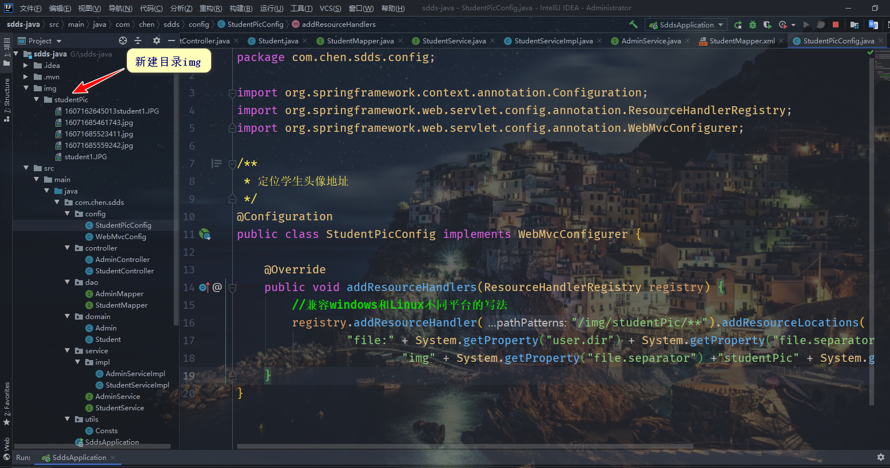

### 前端
#### StudentPage.vue

~~~html
<!--    学生管理页面    -->
<template>
    
 <!--table最小宽度是800px，在css/main.css中定义的-->
        

            

                <!--批量删除-->
                <el-button type="primary" size="mini" @click="delAll">批量删除</el-button>
                <!--根据学生名模糊查询 - BEGIN -->
                <el-input v-model="select_word" size="mini" placeholder="请输入学生名" class="handle-input"></el-input>
                <!--根据学生名模糊查询 - END -->
                <el-button type="primary" size="mini" @click="centerDialogVisible = true">添加学生</el-button>
            

        

        <!--查询学生-BEGIN-->
        <el-table size="mini" border style="width:100%" height="500px" :data="data" 
            @selection-change="handleSelectionChange">   <!--要实现列表分页，这里将tableData改为了data-->
           <!-- 添加一个多选框 -->
           <el-table-column type="selection" width="40"></el-table-column>
           
           <!--学生头像显示-->
            <el-table-column label="学生图片" width="110" align="center">
                <template slot-scope="scope">
                    

                        
                    

                    <!--更新学生图片 - BEGIN-->
                    <el-upload :action="uploadUrl(scope.row.id)" :before-upload = "beforeAvatorUpload"
                    :on-success="handleAvatorSuccess">
                    <el-button size="mini">更新图片</el-button>
                    </el-upload>
                    <!--更新学生图片 - END -->
                </template>
            </el-table-column>

            <!--学生姓名显示-->
            <el-table-column prop="name" label="学生" width="80" align="center"></el-table-column>   

            <!--学生学号显示-->
            <el-table-column label="学号" width="90" align="center">
                <template slot-scope="scope">
                    {{scope.row.id}}
                </template>
            </el-table-column> 

            <!--学生所在院系显示-->
            <el-table-column label="院系" width="150" align="center">
                <template slot-scope="scope">
                    {{changeDepartment(scope.row.department_id)}}
                </template>
            </el-table-column>

            <!--学生所在年级显示-->
            <el-table-column label="年级" width="50" align="center">
                <template slot-scope="scope">
                    {{changeGrade(scope.row.grade_id)}}
                </template>
            </el-table-column>

            <!--学生性别显示-->
            <el-table-column label="性别" width="50" align="center">
                <template slot-scope="scope">
                    {{changeSex(scope.row.sex)}}
                </template>
            </el-table-column>
        
            <!--学生生日显示-->
            <el-table-column prop="birth" label="生日" width="120" align="center">
                <template slot-scope="scope">
                {{attachBirth(scope.row.birth)}}
                </template>
            </el-table-column>  

            <!--学生手机号显示-->
            <el-table-column label="手机号" width="120" align="center">
                <template slot-scope="scope">
                    {{scope.row.phone_number}}
                </template>
            </el-table-column>  

            <!--学生辅导员工号显示-->
            <el-table-column label="辅导员" width="85" align="center">
                <template slot-scope="scope">
                    {{changeInstructor(scope.row.instructor_id)}}
                </template>
            </el-table-column>

            <!--学生家挺住址显示-->
            <el-table-column prop="location" label="家挺住址" width="100" align="center"></el-table-column>    

            <!--学生所在宿舍楼ID显示-->
            <el-table-column label="宿舍楼ID" width="70" align="center">
                <template slot-scope="scope">
                    {{changeFloor(scope.row.floor_id)}}
                </template>
            </el-table-column>   

            <!--学生所在宿舍号显示-->
            <el-table-column label="宿舍号" width="60" align="center">
                <template slot-scope="scope">
                    {{scope.row.dormitory_id}}
                </template>
            </el-table-column>  

            <!--修改学生 -BEGIN-->
            <el-table-column label="操作" width="150" align="center">
                <template slot-scope="scope">
                    <el-button size="mini" @click="handleEdit(scope.row)">编辑</el-button>
                    <!-- 删除学生 -->
                    <el-button size="mini" @click="handleDelete(scope.row.id)">删除</el-button>
                </template>
            </el-table-column>
            <!--修改学生 -END-->
        </el-table>
         <!--查询学生-END-->

         <!--分页 - BEGIN-->
        

            <el-pagination
                background
                layout = "total,prev,pager,next"
                :current-page="currentPage"
                :page-size="pageSize"
                :total="tableData.length"
                @current-change="handleCurrentChange">
            </el-pagination>
        

         <!--分页 - END-->

        <el-dialog title="添加学生" :visible.sync="centerDialogVisible" width="400px" center>
            <el-form :model="registerForm" ref="registerForm" label-width="80px">

                <el-form-item prop="name" label="学生名：" size="mini">
                    <el-input v-model="registerForm.name" placeholder="学生名"></el-input>
                </el-form-item>

                <el-form-item prop="id" label="学号：" size="mini">
                    <el-input v-model="registerForm.id" placeholder="学号"></el-input>
                </el-form-item>

                <el-form-item label="院系：" size="mini">
                    <el-radio-group v-model="registerForm.department_id">
                        <el-radio :label="0">SE</el-radio>
                        <el-radio :label="1">BS</el-radio>
                        <el-radio :label="2">GE</el-radio>
                        <el-radio :label="3">DC</el-radio>
                    </el-radio-group>
                </el-form-item>

                <el-form-item prop="grade_id" label="年级：" size="mini">
                    <el-input v-model="registerForm.grade_id" placeholder="年级"></el-input>
                </el-form-item>

                <el-form-item label="性别：" size="mini">
                    <el-radio-group v-model="registerForm.sex">
                        <el-radio :label="0">女</el-radio>
                        <el-radio :label="1">男</el-radio>
                        <el-radio :label="2">组合</el-radio>
                        <el-radio :label="3">不明</el-radio>
                    </el-radio-group>
                </el-form-item>

                <el-form-item prop="birth" label="生日：" size="mini">
                    <el-date-picker type="date" v-model="registerForm.birth" placeholder="选择日期" style="width:100%"></el-date-picker>
                </el-form-item>

                <el-form-item prop="location" label="住址：" size="mini">
                    <el-input v-model="registerForm.location" placeholder="家挺住址"></el-input>
                </el-form-item>

                 <el-form-item prop="phone_number" label="手机号：" size="mini">
                    <el-input v-model="registerForm.phone_number" placeholder="手机号"></el-input>
                </el-form-item>

                 <el-form-item prop="instructor_id" label="导员ID：" size="mini">
                    <el-input v-model="registerForm.instructor_id" placeholder="辅导员ID"></el-input>
                </el-form-item>

                <el-form-item prop="floor_id" label="宿舍楼：" size="mini">
                    <el-input v-model="registerForm.floor_id" placeholder="宿舍楼"></el-input>
                </el-form-item>

                <el-form-item prop="dormitory_id" label="宿舍号：" size="mini">
                    <el-input v-model="registerForm.dormitory_id" placeholder="宿舍号"></el-input>
                </el-form-item>
            </el-form>
            
                <el-button size="mini" @click="centerDialogVisible = false">取消</el-button>
                <el-button size="mini" @click="addstudent">确定</el-button>
            
        </el-dialog>

        <el-dialog title="修改学生" :visible.sync="editVisible" width="400px" center>
            <el-form :model="form" ref="registerForm" label-width="80px">

               <el-form-item prop="name" label="学生名：" size="mini">
                    <el-input v-model="form.name" placeholder="学生名"></el-input>
                </el-form-item>

                <el-form-item prop="id" label="学号：" size="mini">
                    <el-input v-model="form.id" placeholder="学号"></el-input>
                </el-form-item>

                <el-form-item label="院系：" size="mini">
                    <el-radio-group v-model="form.department_id">
                        <el-radio :label="0">SE</el-radio>
                        <el-radio :label="1">BS</el-radio>
                        <el-radio :label="2">GE</el-radio>
                        <el-radio :label="3">DC</el-radio>
                    </el-radio-group>
                </el-form-item>

                <el-form-item prop="grade_id" label="年级：" size="mini">
                    <el-input v-model="form.grade_id" placeholder="年级"></el-input>
                </el-form-item>

                <el-form-item label="性别：" size="mini">
                    <el-radio-group v-model="form.sex">
                        <el-radio :label="0">女</el-radio>
                        <el-radio :label="1">男</el-radio>
                        <el-radio :label="2">组合</el-radio>
                        <el-radio :label="3">不明</el-radio>
                    </el-radio-group>
                </el-form-item>

                <el-form-item prop="birth" label="生日：" size="mini">
                    <el-date-picker type="date" v-model="form.birth" placeholder="选择日期" style="width:100%"></el-date-picker>
                </el-form-item>

                <el-form-item prop="location" label="家挺住址：" size="mini">
                    <el-input v-model="form.location" placeholder="家挺住址"></el-input>
                </el-form-item>

                 <el-form-item prop="phone_number" label="手机号：" size="mini">
                    <el-input v-model="form.phone_number" placeholder="手机号"></el-input>
                </el-form-item>

                <el-form-item prop="instructor_id" label="辅导员ID：" size="mini">
                    <el-input v-model="form.instructor_id" placeholder="辅导员ID"></el-input>
                </el-form-item>

                <el-form-item prop="floor_id" label="宿舍楼：" size="mini">
                    <el-input v-model="form.floor_id" placeholder="宿舍楼"></el-input>
                </el-form-item>

                <el-form-item prop="dormitory_id" label="宿舍号：" size="mini">
                    <el-input v-model="form.dormitory_id" placeholder="宿舍号"></el-input>
                </el-form-item>
            </el-form>
            
                <el-button size="mini" @click="editVisible = false">取消</el-button>
                <el-button size="mini" @click="editSave">确定</el-button>
            
        </el-dialog>

        <el-dialog title="删除学生" :visible.sync="delVisible" width="300px" center>
            

                删除操作是不可逆的，是否确认删除？
            

            
                <el-button size="mini" @click="delVisible = false">取消</el-button>
                <el-button size="mini" @click="deleteRow">确定</el-button>
            
        </el-dialog>
    

</template>

~~~

#### api配置
修改**sdds -> src -> api -> index.js文件**，添加各种功能实现：

~~~js
import {get,post} from "./http";

//判断管理员是否登录成功
export const getLoginStatus = (params) => post(`admin/login/status`,params);

//查询学生
export const getAllStudent = () => get(`student/allStudent`);

//添加学生
export const setStudent = (params) => post(`student/add`, params);

//修改学生
export const updateStudent = (params) => post(`student/update`, params);

//删除学生
export const delStudent = (id) => get(`student/delete?id=${id}`);
~~~

#### store配置
为了让学生的头像能够显示出来，需要用到**Vue的缓存功能**，修改**sdds -> src -> store -> index.js文件**，如下所示：

~~~js
import Vue from 'vue'
import Vuex from 'vuex'
Vue.use(Vuex)

//放缓存数据
const store = new Vuex.Store({
    state:{
        HOST: 'http://127.0.0.1:8888'
    }
})

export default store    //导出去
~~~

#### mixins通用方法
**src -> mixins -> index.js**文件

~~~js
export const mixin = {
    methods:{
        //提示信息
        notify(title,type){
            this.$notify({
                title: title,
                type: type
            })
        },
        //根据相对地址获取绝对地址，` `是键盘1旁边的`，不是单引号'
        getUrl(url) {
          return `${this.$store.state.HOST}/${url}`
        },
        //获取学生性别信息中文
        changeSex(value) {
            if (value == 0) {
              return '女';
            }
            if (value == 1) {
              return '男';
            }
            if (value == 2) {
              return '组合';
            }
            if (value == 3) {
              return '不明';
            }
            return value;
          }, 
          changeDepartment(value) {
            if (value == 0) {
              return '信息与工程学院';
            }
            if (value == 1) {
              return '商学院';
            }
            if (value == 2) {
              return '通识教育学院';
            }
            if (value == 3) {
              return '设计与创意学院';
            }
            return value;
          },
          changeInstructor(value){
             if (value == 1) {
               return '李峰';
             }
             if (value == 2) {
               return '李成';
             }
             if (value == 3) {
               return '唐三';
             }
             if (value == 4) {
               return '大古';
             }
             return value;
          },
          changeGrade(value) {
            if (value == 1) {
              return '大一';
            }
            if (value == 2) {
              return '大二';
            }
            if (value == 3) {
              return '大三';
            }
            if (value == 4) {
              return '大四';
            }
            return value;
          },
          changeFloor(value) {
             if (value == 1) {
               return '景槐公寓';
             }
             if (value == 2) {
               return '北泉公寓';
             }
             if (value == 3) {
               return '柳湾公寓';
             }
          },
          //获取学生生日，主要是为了转换生日的格式
          attachBirth(val) {
            return String(val).substr(0, 10); //只保留年月日，去除时分秒
          },
           //上传头像图片之前的校验
           beforeAvatorUpload(file) {
               const isJPG = (file.type === 'image/jpeg') || (file.type === 'image/png');
               if (!isJPG) {
                 this.$message.error('上传的头像图片只能是jpg或png格式！');
                 return false;
               }
               //判断照片大小是否超过2MB
               const isLt2M = (file.size / 1024 / 1024) < 2;
               if (!isLt2M) {
                 this.$message.error('上传的头像图片不能超过2MB大小！');
                 return false;
               }
               return true;
             },
             //上传图片成功之后要做的工作
             handleAvatorSuccess(res) {
               let _this = this;
               if (res.code == 1) {
                 _this.getData(); //重新查询一下所有数据，充当刷新页面功能
                 _this.$notify({
                   title: '上传成功',
                   type: 'success'
                 });
               } else {
                 _this.$notify({
                   title: '上传失败',
                   type: 'error'
                 });
               }
             },
             //弹出删除窗口
             handleDelete(id) {
               this.idx = id;
               this.delVisible = true;
             },
             //把已经选择的项赋值给 multipleSelection
             handleSelectionChange(val) {
               this.multipleSelection = val;
             },
             //批量删除已经选择的项
             delAll() {
               for (let item of this.multipleSelection) {
                 this.handleDelete(item.id);
                 this.deleteRow();
               }
               this.multipleSelection = []; //删除完后将 multipleSelection 清空
             }
    }
}
~~~

#### 此时的项目目录

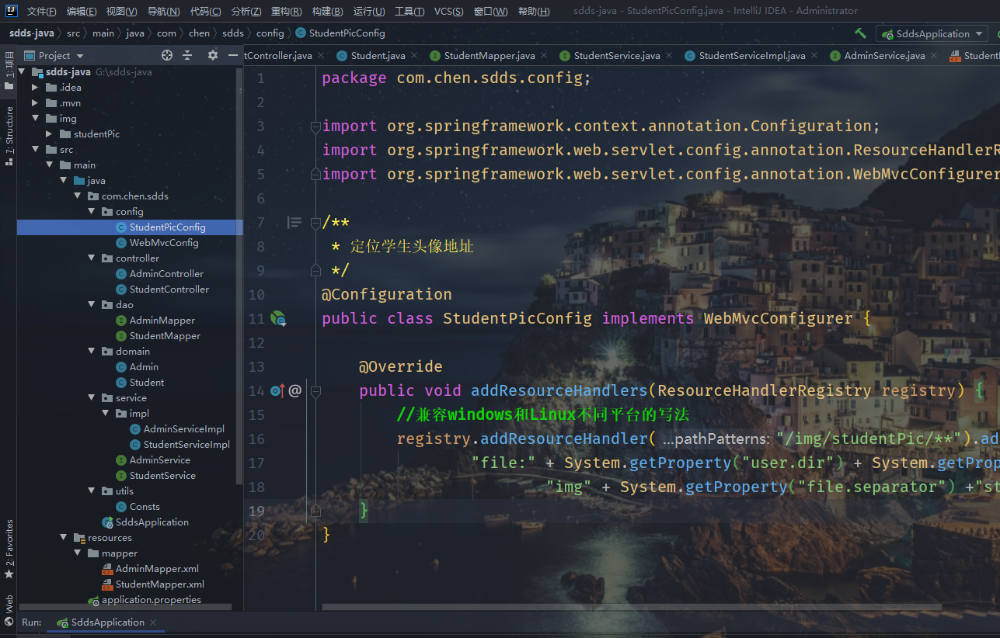

### 效果展示

#### 增加操作
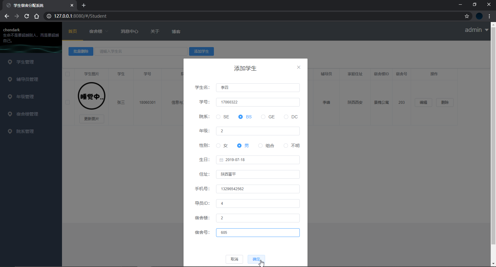

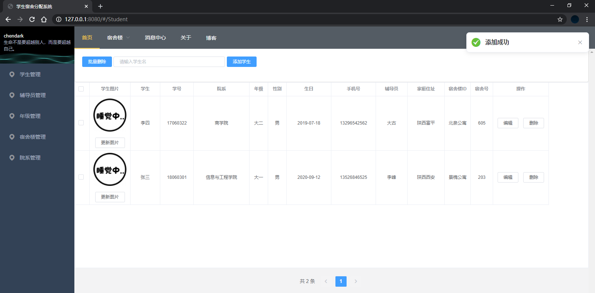

#### 删除操作
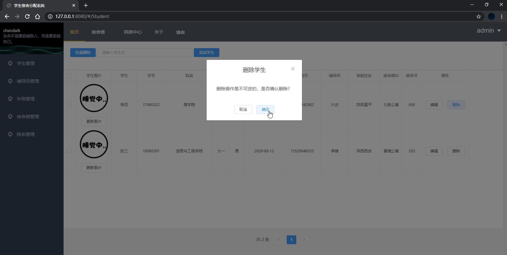

#### 修改操作
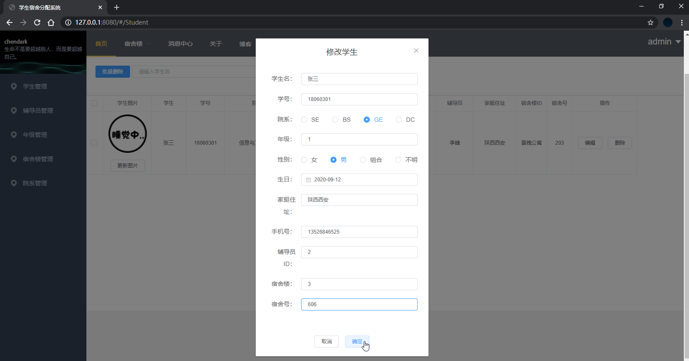

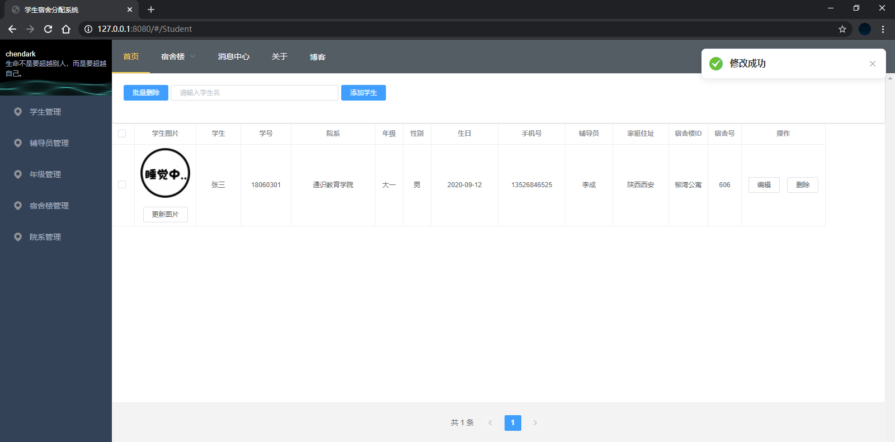

#### 查询操作

**1.修改学生头像，如下所示：**

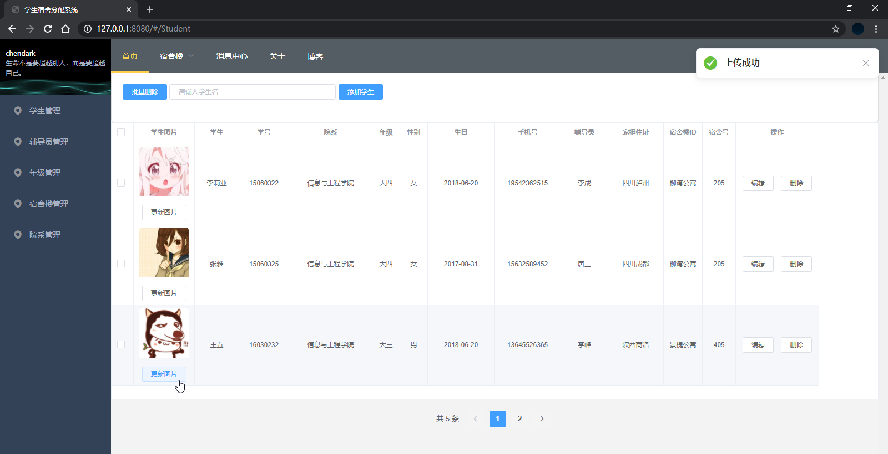

2.给**数据库sdds**的**student表**添加了如下数据：

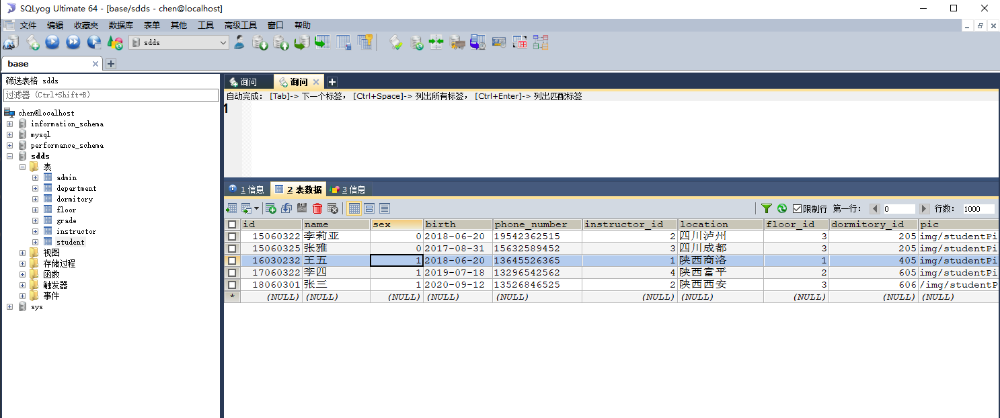

3.根据学生的姓名进行模糊查询：

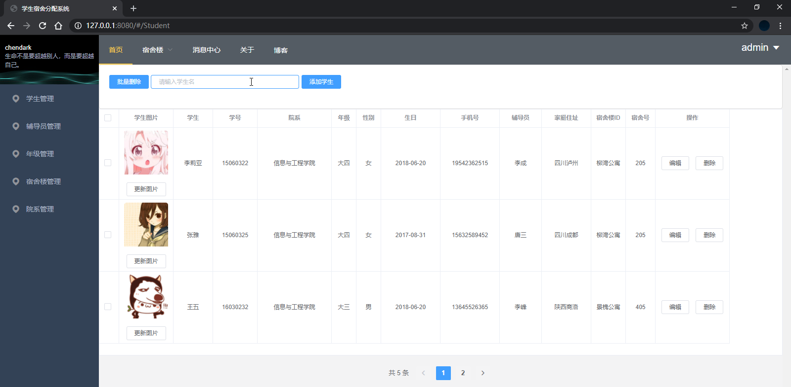

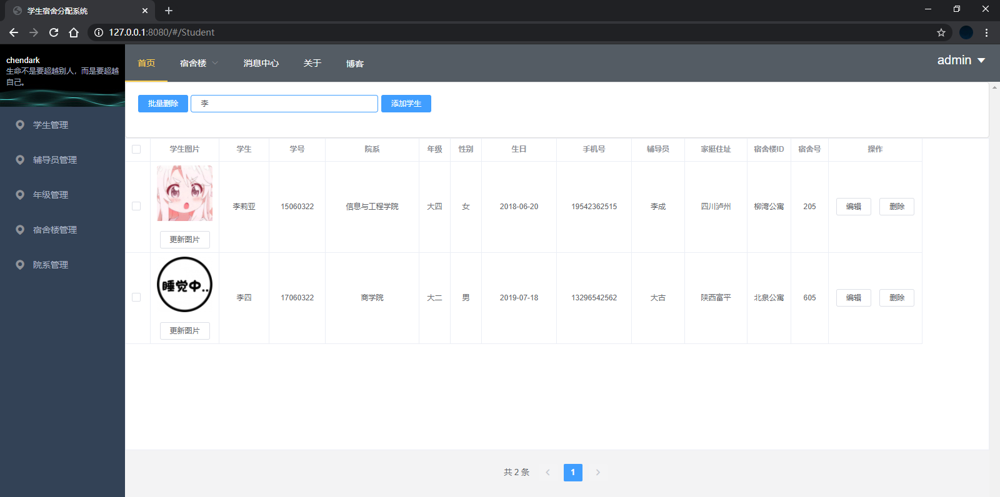

4.根据学号进行查询：
a.在**src -> api -> index.js**文件中添加**根据id查询对象**的方法：

~~~js
//根据id查询整个对象
export const selectById = (id) => get(`student/selectById?id=${id}`);
~~~

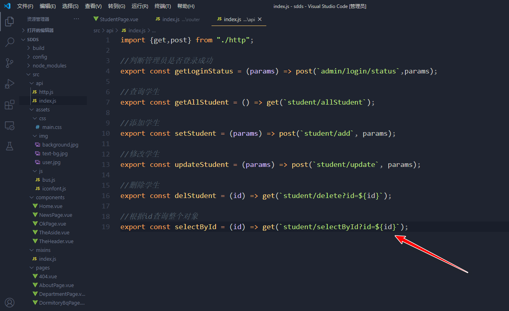

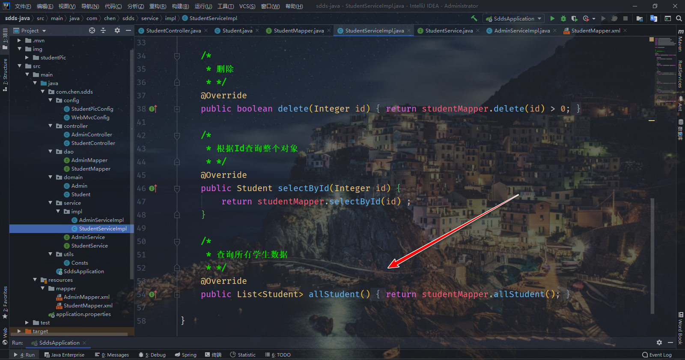

b.修改**pages -> StudentPage.vue**，如下：

~~~html
<!--根据学生学号查询 - BEGIN -->
  <el-input v-model="select_id" size="mini" placeholder="请输入学号" class="handle-input"></el-input>
<!--根据学生学号查询 - END -->
~~~

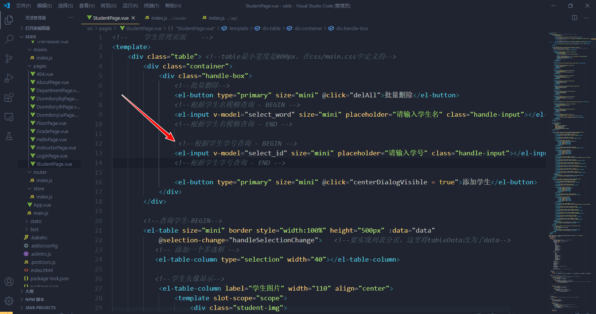

~~~html

~~~

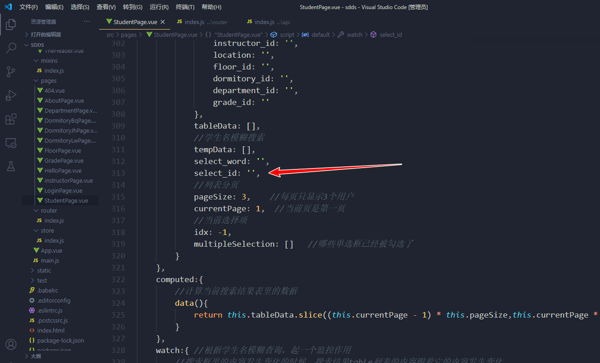

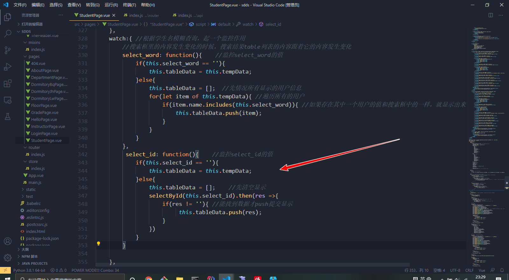

c.查看效果：

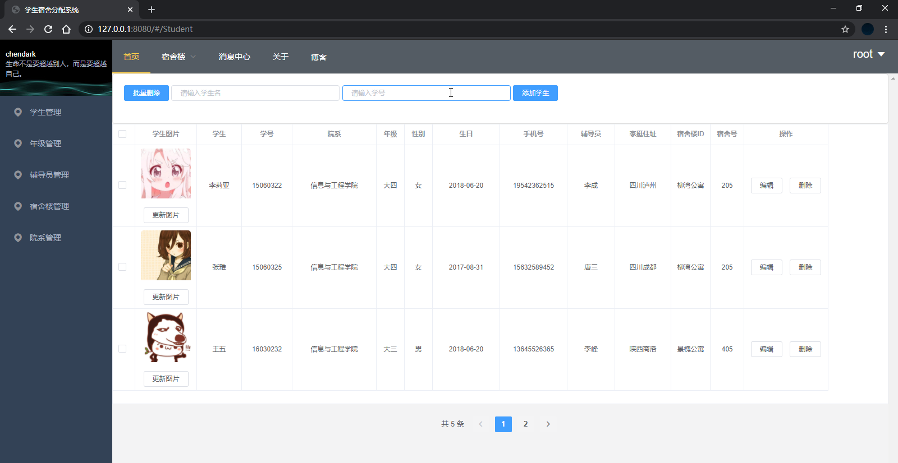

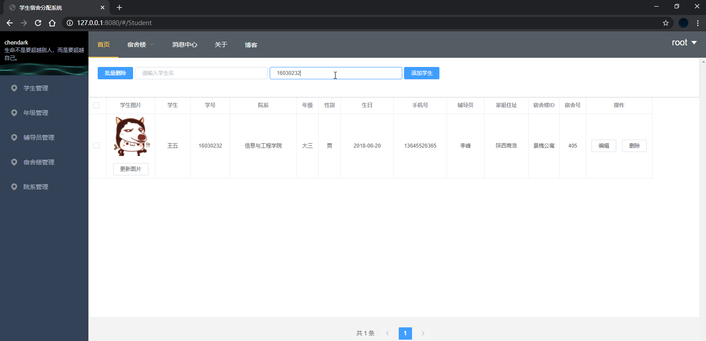

### 学生管理页面完整代码

~~~html
<!--    学生管理页面    -->
<template>
    
 <!--table最小宽度是800px，在css/main.css中定义的-->
        

            

                <!--批量删除-->
                <el-button type="primary" size="mini" @click="delAll">批量删除</el-button>
                <!--根据学生名模糊查询 - BEGIN -->
                <el-input v-model="select_word" size="mini" placeholder="请输入学生名" class="handle-input"></el-input>
                <!--根据学生名模糊查询 - END -->

                <!--根据学生学号查询 - BEGIN -->
                <el-input v-model="select_id" size="mini" placeholder="请输入学号" class="handle-input"></el-input>
                <!--根据学生学号查询 - END -->

                <el-button type="primary" size="mini" @click="centerDialogVisible = true">添加学生</el-button>
            

        

        <!--查询学生-BEGIN-->
        <el-table size="mini" border style="width:100%" height="500px" :data="data" 
            @selection-change="handleSelectionChange">   <!--要实现列表分页，这里将tableData改为了data-->
           <!-- 添加一个多选框 -->
           <el-table-column type="selection" width="40"></el-table-column>
           
           <!--学生头像显示-->
            <el-table-column label="学生图片" width="110" align="center">
                <template slot-scope="scope">
                    

                        
                    

                    <!--更新学生图片 - BEGIN-->
                    <el-upload :action="uploadUrl(scope.row.id)" :before-upload = "beforeAvatorUpload"
                    :on-success="handleAvatorSuccess">
                    <el-button size="mini">更新图片</el-button>
                    </el-upload>
                    <!--更新学生图片 - END -->
                </template>
            </el-table-column>

            <!--学生姓名显示-->
            <el-table-column prop="name" label="学生" width="80" align="center"></el-table-column>   

            <!--学生学号显示-->
            <el-table-column label="学号" width="90" align="center">
                <template slot-scope="scope">
                    {{scope.row.id}}
                </template>
            </el-table-column> 

            <!--学生所在院系显示-->
            <el-table-column label="院系" width="150" align="center">
                <template slot-scope="scope">
                    {{changeDepartment(scope.row.department_id)}}
                </template>
            </el-table-column>

            <!--学生所在年级显示-->
            <el-table-column label="年级" width="50" align="center">
                <template slot-scope="scope">
                    {{changeGrade(scope.row.grade_id)}}
                </template>
            </el-table-column>

            <!--学生性别显示-->
            <el-table-column label="性别" width="50" align="center">
                <template slot-scope="scope">
                    {{changeSex(scope.row.sex)}}
                </template>
            </el-table-column>
        
            <!--学生生日显示-->
            <el-table-column prop="birth" label="生日" width="120" align="center">
                <template slot-scope="scope">
                {{attachBirth(scope.row.birth)}}
                </template>
            </el-table-column>  

            <!--学生手机号显示-->
            <el-table-column label="手机号" width="120" align="center">
                <template slot-scope="scope">
                    {{scope.row.phone_number}}
                </template>
            </el-table-column>  

            <!--学生辅导员工号显示-->
            <el-table-column label="辅导员" width="85" align="center">
                <template slot-scope="scope">
                    {{changeInstructor(scope.row.instructor_id)}}
                </template>
            </el-table-column>

            <!--学生家挺住址显示-->
            <el-table-column prop="location" label="家挺住址" width="100" align="center"></el-table-column>    

            <!--学生所在宿舍楼ID显示-->
            <el-table-column label="宿舍楼ID" width="70" align="center">
                <template slot-scope="scope">
                    {{changeFloor(scope.row.floor_id)}}
                </template>
            </el-table-column>   

            <!--学生所在宿舍号显示-->
            <el-table-column label="宿舍号" width="60" align="center">
                <template slot-scope="scope">
                    {{scope.row.dormitory_id}}
                </template>
            </el-table-column>  

            <!--修改学生 -BEGIN-->
            <el-table-column label="操作" width="150" align="center">
                <template slot-scope="scope">
                    <el-button size="mini" @click="handleEdit(scope.row)">编辑</el-button>
                    <!-- 删除学生 -->
                    <el-button size="mini" @click="handleDelete(scope.row.id)">删除</el-button>
                </template>
            </el-table-column>
            <!--修改学生 -END-->
        </el-table>
         <!--查询学生-END-->

         <!--分页 - BEGIN-->
        

            <el-pagination
                background
                layout = "total,prev,pager,next"
                :current-page="currentPage"
                :page-size="pageSize"
                :total="tableData.length"
                @current-change="handleCurrentChange">
            </el-pagination>
        

         <!--分页 - END-->

        <el-dialog title="添加学生" :visible.sync="centerDialogVisible" width="400px" center>
            <el-form :model="registerForm" ref="registerForm" label-width="80px">

                <el-form-item prop="name" label="学生名：" size="mini">
                    <el-input v-model="registerForm.name" placeholder="学生名"></el-input>
                </el-form-item>

                <el-form-item prop="id" label="学号：" size="mini">
                    <el-input v-model="registerForm.id" placeholder="学号"></el-input>
                </el-form-item>

                <el-form-item label="院系：" size="mini">
                    <el-radio-group v-model="registerForm.department_id">
                        <el-radio :label="0">SE</el-radio>
                        <el-radio :label="1">BS</el-radio>
                        <el-radio :label="2">GE</el-radio>
                        <el-radio :label="3">DC</el-radio>
                    </el-radio-group>
                </el-form-item>

                <el-form-item prop="grade_id" label="年级：" size="mini">
                    <el-input v-model="registerForm.grade_id" placeholder="年级"></el-input>
                </el-form-item>

                <el-form-item label="性别：" size="mini">
                    <el-radio-group v-model="registerForm.sex">
                        <el-radio :label="0">女</el-radio>
                        <el-radio :label="1">男</el-radio>
                        <el-radio :label="2">组合</el-radio>
                        <el-radio :label="3">不明</el-radio>
                    </el-radio-group>
                </el-form-item>

                <el-form-item prop="birth" label="生日：" size="mini">
                    <el-date-picker type="date" v-model="registerForm.birth" placeholder="选择日期" style="width:100%"></el-date-picker>
                </el-form-item>

                <el-form-item prop="location" label="住址：" size="mini">
                    <el-input v-model="registerForm.location" placeholder="家挺住址"></el-input>
                </el-form-item>

                 <el-form-item prop="phone_number" label="手机号：" size="mini">
                    <el-input v-model="registerForm.phone_number" placeholder="手机号"></el-input>
                </el-form-item>

                 <el-form-item prop="instructor_id" label="导员ID：" size="mini">
                    <el-input v-model="registerForm.instructor_id" placeholder="辅导员ID"></el-input>
                </el-form-item>

                <el-form-item prop="floor_id" label="宿舍楼：" size="mini">
                    <el-input v-model="registerForm.floor_id" placeholder="宿舍楼"></el-input>
                </el-form-item>

                <el-form-item prop="dormitory_id" label="宿舍号：" size="mini">
                    <el-input v-model="registerForm.dormitory_id" placeholder="宿舍号"></el-input>
                </el-form-item>
            </el-form>
            
                <el-button size="mini" @click="centerDialogVisible = false">取消</el-button>
                <el-button size="mini" @click="addstudent">确定</el-button>
            
        </el-dialog>

        <el-dialog title="修改学生" :visible.sync="editVisible" width="400px" center>
            <el-form :model="form" ref="registerForm" label-width="80px">

               <el-form-item prop="name" label="学生名：" size="mini">
                    <el-input v-model="form.name" placeholder="学生名"></el-input>
                </el-form-item>

                <el-form-item prop="id" label="学号：" size="mini">
                    <el-input v-model="form.id" placeholder="学号"></el-input>
                </el-form-item>

                <el-form-item label="院系：" size="mini">
                    <el-radio-group v-model="form.department_id">
                        <el-radio :label="0">SE</el-radio>
                        <el-radio :label="1">BS</el-radio>
                        <el-radio :label="2">GE</el-radio>
                        <el-radio :label="3">DC</el-radio>
                    </el-radio-group>
                </el-form-item>

                <el-form-item prop="grade_id" label="年级：" size="mini">
                    <el-input v-model="form.grade_id" placeholder="年级"></el-input>
                </el-form-item>

                <el-form-item label="性别：" size="mini">
                    <el-radio-group v-model="form.sex">
                        <el-radio :label="0">女</el-radio>
                        <el-radio :label="1">男</el-radio>
                        <el-radio :label="2">组合</el-radio>
                        <el-radio :label="3">不明</el-radio>
                    </el-radio-group>
                </el-form-item>

                <el-form-item prop="birth" label="生日：" size="mini">
                    <el-date-picker type="date" v-model="form.birth" placeholder="选择日期" style="width:100%"></el-date-picker>
                </el-form-item>

                <el-form-item prop="location" label="家挺住址：" size="mini">
                    <el-input v-model="form.location" placeholder="家挺住址"></el-input>
                </el-form-item>

                 <el-form-item prop="phone_number" label="手机号：" size="mini">
                    <el-input v-model="form.phone_number" placeholder="手机号"></el-input>
                </el-form-item>

                <el-form-item prop="instructor_id" label="辅导员ID：" size="mini">
                    <el-input v-model="form.instructor_id" placeholder="辅导员ID"></el-input>
                </el-form-item>

                <el-form-item prop="floor_id" label="宿舍楼：" size="mini">
                    <el-input v-model="form.floor_id" placeholder="宿舍楼"></el-input>
                </el-form-item>

                <el-form-item prop="dormitory_id" label="宿舍号：" size="mini">
                    <el-input v-model="form.dormitory_id" placeholder="宿舍号"></el-input>
                </el-form-item>
            </el-form>
            
                <el-button size="mini" @click="editVisible = false">取消</el-button>
                <el-button size="mini" @click="editSave">确定</el-button>
            
        </el-dialog>

        <el-dialog title="删除学生" :visible.sync="delVisible" width="300px" center>
            

                删除操作是不可逆的，是否确认删除？
            

            
                <el-button size="mini" @click="delVisible = false">取消</el-button>
                <el-button size="mini" @click="deleteRow">确定</el-button>
            
        </el-dialog>
    

</template>

~~~

## 年级管理页面实现
编写**src -> pages -> GradePage.vue**文件，如下所示：

~~~html
<!--    年级管理页面    -->
<template>
    
 <!--table最小宽度是800px，在css/main.css中定义的-->
        

            

                <!--批量删除-->
                <el-button type="primary" size="mini" @click="delAll">批量删除</el-button>
                <!--根据年级查询 - BEGIN -->
                <el-input v-model="select_word" size="mini" placeholder="请输入年级：1是大一，依次类推" class="handle-input"></el-input>
                <!--根据年级查询 - END -->
                <el-button type="primary" size="mini" @click="centerDialogVisible = true">添加学生</el-button>
            

        

        <!--查询学生-BEGIN-->
        <el-table size="mini" border style="width:100%" height="500px" :data="data" 
            @selection-change="handleSelectionChange">  
            <!-- ... -->
        </el-table>
         <!--查询学生-END-->

         <!--分页 - BEGIN-->
        

           <!-- ... -->
        

         <!--分页 - END-->

        <el-dialog title="添加学生" :visible.sync="centerDialogVisible" width="400px" center>
            <!-- ... -->
        </el-dialog>

        <el-dialog title="修改学生" :visible.sync="editVisible" width="400px" center>
            <!-- ... -->
        </el-dialog>

        <el-dialog title="删除学生" :visible.sync="delVisible" width="300px" center>
            <!-- ... -->
        </el-dialog>
    

</template>

<!-- ... -->
~~~

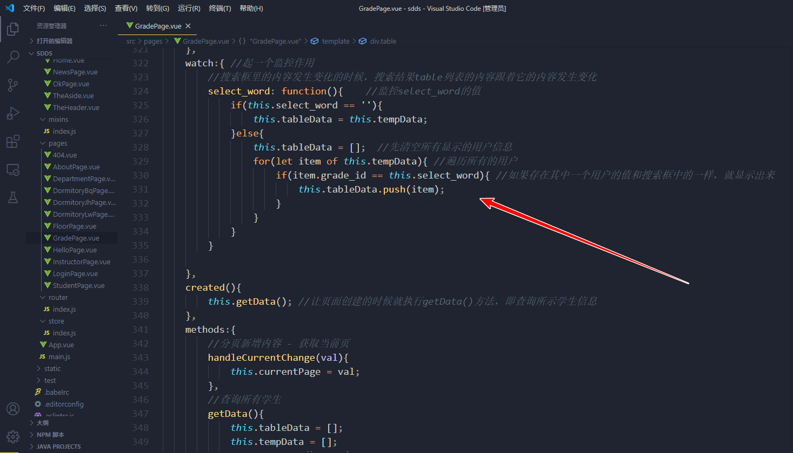

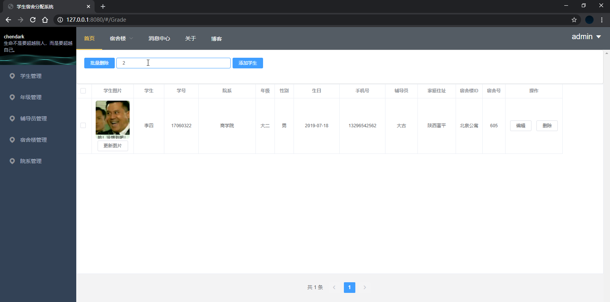

## 辅导员管理页面

编写**src -> pages -> InstructorPage.vue**文件，如下所示：

~~~html
<!--    辅导员管理页面    -->
<template>
    
 <!--table最小宽度是800px，在css/main.css中定义的-->
        

            

                <!--批量删除-->
                <el-button type="primary" size="mini" @click="delAll">批量删除</el-button>
               <!--根据辅导员id查询 - BEGIN -->
                <el-input v-model="select_word" size="mini" placeholder="请输入要查询的辅导员编号" class="handle-input"></el-input>
                <!--根据年级id查询 - END -->
                <el-button type="primary" size="mini" @click="centerDialogVisible = true">添加学生</el-button>
            

        

        <!--查询学生-BEGIN-->
        <el-table size="mini" border style="width:100%" height="500px" :data="data" 
            @selection-change="handleSelectionChange">  
            <!-- ... -->
        </el-table>
         <!--查询学生-END-->

         <!--分页 - BEGIN-->
        

           <!-- ... -->
        

         <!--分页 - END-->

        <el-dialog title="添加学生" :visible.sync="centerDialogVisible" width="400px" center>
            <!-- ... -->
        </el-dialog>

        <el-dialog title="修改学生" :visible.sync="editVisible" width="400px" center>
            <!-- ... -->
        </el-dialog>

        <el-dialog title="删除学生" :visible.sync="delVisible" width="300px" center>
            <!-- ... -->
        </el-dialog>
    

</template>

<!-- ... -->
~~~

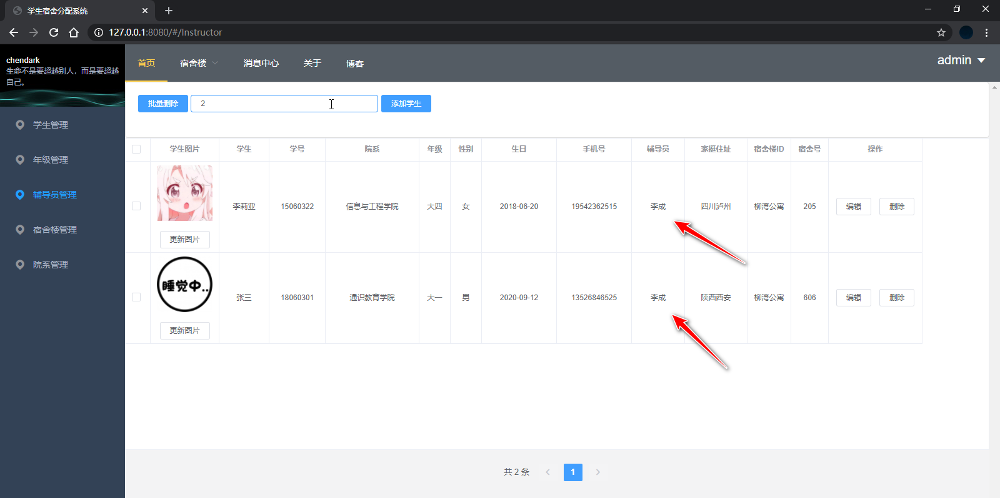

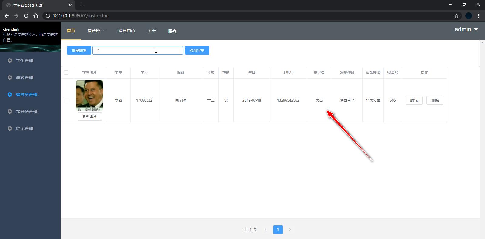

## 宿舍楼管理
编写**src -> pages -> FloorPage.vue**文件，如下所示：

~~~html
<!--    宿舍楼管理页面    -->
<template>
    
 <!--table最小宽度是800px，在css/main.css中定义的-->
        

            

                <!--批量删除-->
                <el-button type="primary" size="mini" @click="delAll">批量删除</el-button>
                <!--根据宿舍楼查询 - BEGIN -->
                <el-input v-model="select_word" size="mini" placeholder="请输入要查询的宿舍楼编号" class="handle-input"></el-input>
                <!--根据宿舍楼查询 - END -->
                <el-button type="primary" size="mini" @click="centerDialogVisible = true">添加学生</el-button>
            

        

        <!--查询学生-BEGIN-->
        <el-table size="mini" border style="width:100%" height="500px" :data="data" 
            @selection-change="handleSelectionChange">  
            <!-- ... -->
        </el-table>
         <!--查询学生-END-->

         <!--分页 - BEGIN-->
        

           <!-- ... -->
        

         <!--分页 - END-->

        <el-dialog title="添加学生" :visible.sync="centerDialogVisible" width="400px" center>
            <!-- ... -->
        </el-dialog>

        <el-dialog title="修改学生" :visible.sync="editVisible" width="400px" center>
            <!-- ... -->
        </el-dialog>

        <el-dialog title="删除学生" :visible.sync="delVisible" width="300px" center>
            <!-- ... -->
        </el-dialog>
    

</template>

<!-- ... -->
~~~

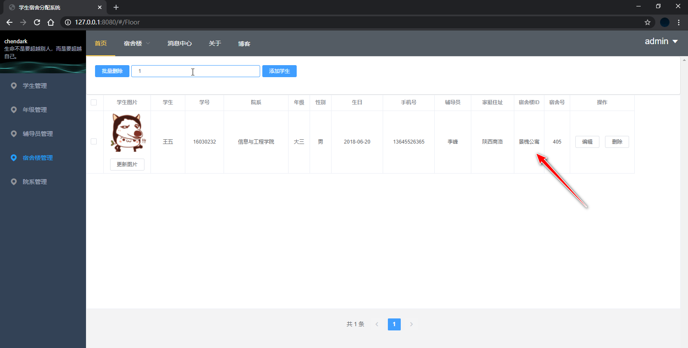

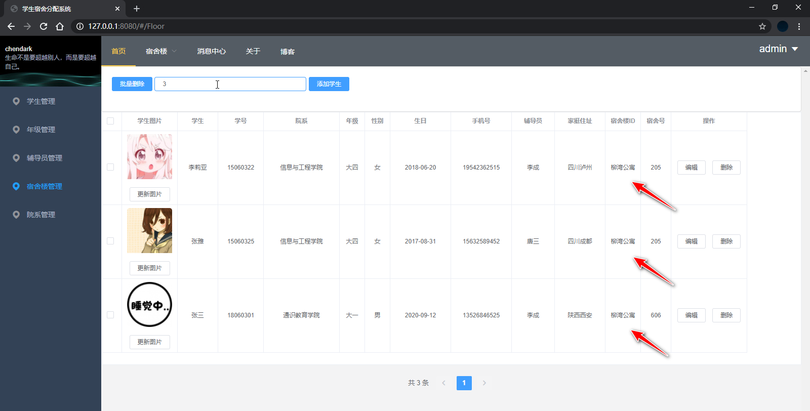

## 院系管理页面

编写**src -> pages -> DepartmentPage.vue**文件，如下所示：

~~~html
<!--    院系管理页面    -->
<template>
    
 <!--table最小宽度是800px，在css/main.css中定义的-->
        

            

                <!--批量删除-->
                <el-button type="primary" size="mini" @click="delAll">批量删除</el-button>
               <!--根据院系查询 - BEGIN -->
                <el-input v-model="select_word" size="mini" placeholder="请输入要查询的院系编号" class="handle-input"></el-input>
                <!--根据院系查询 - END -->
                <el-button type="primary" size="mini" @click="centerDialogVisible = true">添加学生</el-button>
            

        

        <!--查询学生-BEGIN-->
        <el-table size="mini" border style="width:100%" height="500px" :data="data" 
            @selection-change="handleSelectionChange">  
            <!-- ... -->
        </el-table>
         <!--查询学生-END-->

         <!--分页 - BEGIN-->
        

           <!-- ... -->
        

         <!--分页 - END-->

        <el-dialog title="添加学生" :visible.sync="centerDialogVisible" width="400px" center>
            <!-- ... -->
        </el-dialog>

        <el-dialog title="修改学生" :visible.sync="editVisible" width="400px" center>
            <!-- ... -->
        </el-dialog>

        <el-dialog title="删除学生" :visible.sync="delVisible" width="300px" center>
            <!-- ... -->
        </el-dialog>
    

</template>

<!-- ... -->
~~~

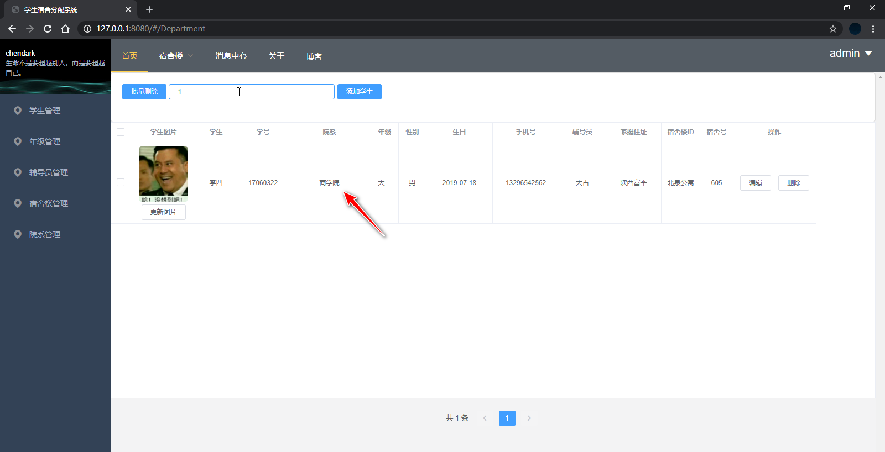

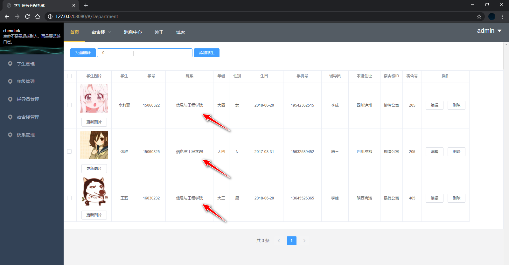

# 后台首页实现
## 后端
1.修改**controller -> AdminController.java**文件，如下所示：

~~~java
package com.chen.sdds.controller;
import com.alibaba.fastjson.JSONObject;
import com.chen.sdds.service.AdminService;
import com.chen.sdds.utils.Consts;
import org.springframework.beans.factory.annotation.Autowired;
import org.springframework.web.bind.annotation.RequestMapping;
import org.springframework.web.bind.annotation.RequestMethod;
import org.springframework.web.bind.annotation.RestController;

import javax.servlet.http.HttpServletRequest;
import javax.servlet.http.HttpSession;
/*
 *控制层
 */
@RestController
public class AdminController {
    @Autowired
    private AdminService adminService;

    /*
     * 判断是否登录成功
     * */
    @RequestMapping(value = "/admin/login/status",method = RequestMethod.POST)
    public Object loginStatus(HttpServletRequest request, HttpSession session){
        JSONObject jsonObject = new JSONObject();
        String name = request.getParameter("name");
        String password = request.getParameter("password");
        boolean flag = adminService.verifyPassword(name,password);
        if (flag){
            jsonObject.put(Consts.CODE,1);
            jsonObject.put("msg","登录成功");
            session.setAttribute(Consts.NAME,name);
            return jsonObject;
        }
        jsonObject.put(Consts.CODE,0);
        jsonObject.put("msg","用户名或密码错误");
        return jsonObject;
    }

    /*
     * 查询所有网站管理员数据
     * */
    @RequestMapping(value = "/admin/getAllAdmin",method = RequestMethod.GET)
    public Object getAllAdmin(HttpServletRequest request) {
        return adminService.getAllAdmin();
    }

}
~~~

2.修改**dao -> AdminMapper.java**文件，如下所示：

~~~java
package com.chen.sdds.dao;
import com.chen.sdds.domain.Admin;
import org.springframework.stereotype.Repository;

import java.util.List;

/*
 * 管理员Dao，数据访问层
 * */
@Repository
public interface AdminMapper {
    /*
     * 验证密码是否正确
     * */
    int verifyPassword(String username, String password);

    /*
     * 查询所有网站管理员数据
     * */
    public List<Admin> getAllAdmin();
}
~~~

3.修改**service -> AdminService.java**文件，如下所示：

~~~java
package com.chen.sdds.service;

import com.chen.sdds.domain.Admin;

import java.util.List;

/*
 * 管理员service接口，业务层
 * */
public interface AdminService {
    /*
     * 验证密码是否正确
     * */
    public boolean verifyPassword(String username,String password);

    /*
     * 查询所有网站管理员数据
     * */
    public List<Admin> getAllAdmin();
}
~~~

4.修改**service -> impl -> AdminServiceImpl.java**文件，如下所示：

~~~java
package com.chen.sdds.service.impl;
import com.chen.sdds.dao.AdminMapper;
import com.chen.sdds.domain.Admin;
import com.chen.sdds.service.AdminService;
import org.springframework.beans.factory.annotation.Autowired;
import org.springframework.stereotype.Service;

import java.util.List;

/*
 * 管理员service实现类
 * */
@Service
public class AdminServiceImpl implements AdminService {

    @Autowired
    private AdminMapper adminMapper;
    /*
     * 验证密码是否正确
     * */
    @Override
    public boolean verifyPassword(String username, String password) {
        return adminMapper.verifyPassword(username,password)>0; //大于0则返回True
    }

    /*
     * 查询所有网站管理员数据
     * */
    @Override
    public List<Admin> getAllAdmin() {
        return adminMapper. getAllAdmin();
    }

}
~~~

5.修改**resources -> mapper -> AdminMapper.xml**文件，如下所示:

~~~java
<?xml version="1.0" encoding="UTF-8"?>
<!DOCTYPE mapper PUBLIC
        "-//mybatis.org//DTD Mapper 3.0//EN"
        "http://mybatis.org/dtd/mybatis-3-mapper.dtd">
<mapper namespace="com.chen.sdds.dao.AdminMapper">
    <resultMap id="BaseResultMap" type="com.chen.sdds.domain.Admin" >
        <id column="id" jdbcType="INTEGER" property="id"/>
        <result column="name" jdbcType="VARCHAR" property="name"/>
        <result column="password" jdbcType="VARCHAR" property="password"/>
    </resultMap>

    <sql id="Base_Column_List">
        id,name,password
    </sql>

    <select id="verifyPassword" resultType="java.lang.Integer">
        select count(*) from admin where name=#{username} and password=#{password}
    </select>

    <!--- 查询所有网站管理员数据-Begin -->
    <select id="getAllAdmin" resultMap="BaseResultMap">
        select
        <include refid="Base_Column_List"/>
        from admin
    </select>
    <!--- 查询所有网站管理员数据-End -->
</mapper>
~~~

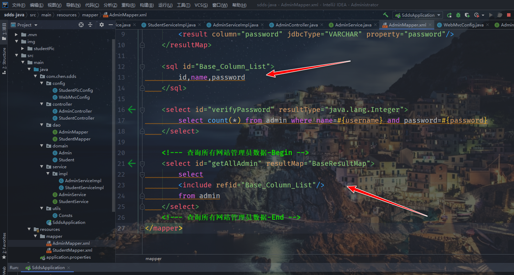

## 前端
**修改HelloPage.vue**文件，如下所示：

~~~html
<template>
    

        <el-row :gutter="20" class="mgb20">
            <el-col :span="6">
                <el-card>
                    

                        

                            
{{adminCount}}

                            
网站管理员总数

                        

                    

                </el-card>
            </el-col>
            <el-col :span="6">
                <el-card>
                    

                        

                            
{{studentCount}}

                            
学生总数

                        

                    

                </el-card>
            </el-col>
             <el-col :span="6">
                <el-card>
                    

                        

                            
{{floorCount}}

                            
宿舍楼数

                        

                    

                </el-card>
            </el-col>
             <el-col :span="6">
                <el-card>
                    

                        

                            
{{dormitoryCount}}

                            
宿舍总数

                        

                    

                </el-card>
            </el-col>
        </el-row>
        <el-row :gutter="20" class="mgb20">
            <el-col :span="12">
                <h3 class="mgb20">学生性别比例</h3>
                

                    <ve-pie :data="studentSex"></ve-pie>
                

            </el-col>
            <el-col :span="12">
                <h3 class="mgb20">学生来源分布</h3>
                

                    <ve-histogram :data="location" :theme="options"></ve-histogram>
                

            </el-col>
        </el-row>
    

</template>

~~~

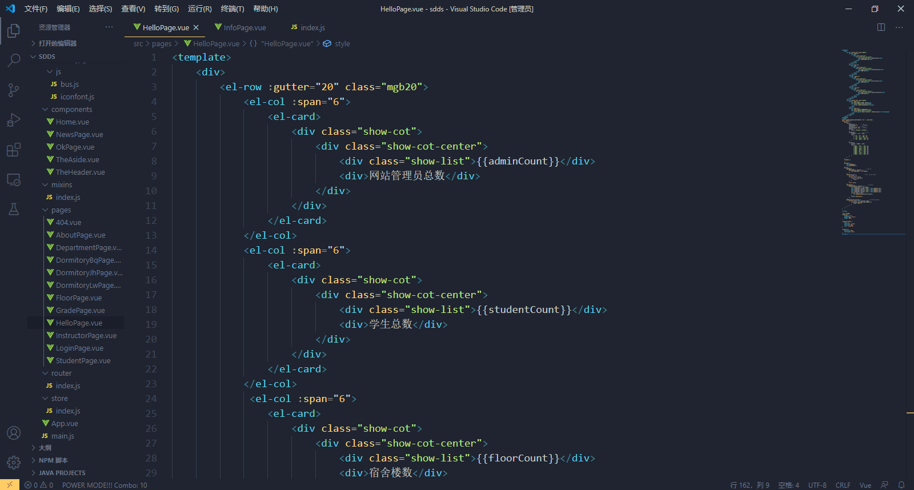

## 效果展示

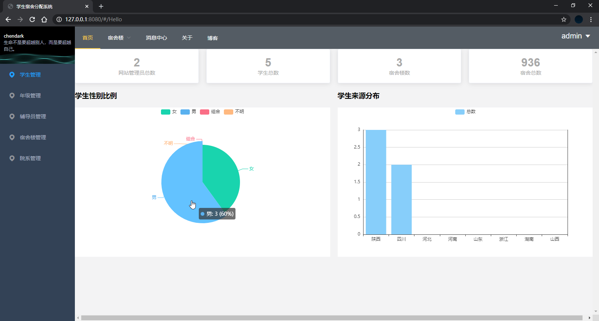

# 查询空宿舍情况
## 景槐公寓
修改**src ->pages -> DormitoryJhPage.vue**文件，如下所示：

~~~html
<!--    宿舍楼景槐公寓管理页面    -->
<template>
    
 <!--table最小宽度是800px，在css/main.css中定义的-->

      <el-row :gutter="20" class="mgb20">
                  <el-col :span="6">
                      <el-card>
                          

                              

                                  
{{allDMCount}}

                                  
该宿舍成员人数

                              

                          

                      </el-card>
                  </el-col>
                  <el-col :span="6">
                      <el-card>
                          

                              

                                  
{{adviceCount}}

                                  
该宿舍可入住人数

                              

                          

                      </el-card>
                  </el-col>
                  <el-col :span="6">
                      <el-card>
                          

                              

                                  
{{maxCount}}

                                  
每个宿舍最大可住人数

                              

                          

                      </el-card>
                  </el-col>
                  <el-col :span="6">
                      <el-card>
                          

                              

                                  
&景槐宿舍&

                              

                          

                      </el-card>
                  </el-col>
      </el-row>

        

            

                <!--批量删除-->
                <el-button type="primary" size="mini" @click="delAll">批量删除</el-button>
                <!--根据宿舍号查询 - BEGIN -->
                <el-input v-model="select_word" size="mini" placeholder="请输入要查询的宿舍号" class="handle-input"></el-input>
                <!--根据宿舍号查询 - END -->
                <el-button id="add_main" type="primary" size="mini" @click="centerDialogVisible = true">添加学生</el-button>
            

        

        <!--查询学生-BEGIN-->
        <el-table size="mini" border style="width:100%" height="500px" :data="data" 
            @selection-change="handleSelectionChange">   <!--要实现列表分页，这里将tableData改为了data-->
           <!-- 添加一个多选框 -->
           <el-table-column type="selection" width="40"></el-table-column>
           
           <!--学生头像显示-->
            <el-table-column label="学生图片" width="110" align="center">
                <template slot-scope="scope">
                    

                        
                    

                    <!--更新学生图片 - BEGIN-->
                    <el-upload :action="uploadUrl(scope.row.id)" :before-upload = "beforeAvatorUpload"
                    :on-success="handleAvatorSuccess">
                    <el-button size="mini">更新图片</el-button>
                    </el-upload>
                    <!--更新学生图片 - END -->
                </template>
            </el-table-column>

            <!--学生姓名显示-->
            <el-table-column prop="name" label="学生" width="80" align="center"></el-table-column>   

            <!--学生学号显示-->
            <el-table-column label="学号" width="90" align="center">
                <template slot-scope="scope">
                    {{scope.row.id}}
                </template>
            </el-table-column> 

            <!--学生所在院系显示-->
            <el-table-column label="院系" width="150" align="center">
                <template slot-scope="scope">
                    {{changeDepartment(scope.row.department_id)}}
                </template>
            </el-table-column>

            <!--学生所在年级显示-->
            <el-table-column label="年级" width="50" align="center">
                <template slot-scope="scope">
                    {{changeGrade(scope.row.grade_id)}}
                </template>
            </el-table-column>

            <!--学生性别显示-->
            <el-table-column label="性别" width="50" align="center">
                <template slot-scope="scope">
                    {{changeSex(scope.row.sex)}}
                </template>
            </el-table-column>
        
            <!--学生生日显示-->
            <el-table-column prop="birth" label="生日" width="120" align="center">
                <template slot-scope="scope">
                {{attachBirth(scope.row.birth)}}
                </template>
            </el-table-column>  

            <!--学生手机号显示-->
            <el-table-column label="手机号" width="120" align="center">
                <template slot-scope="scope">
                    {{scope.row.phone_number}}
                </template>
            </el-table-column>  

            <!--学生辅导员工号显示-->
            <el-table-column label="辅导员" width="85" align="center">
                <template slot-scope="scope">
                    {{changeInstructor(scope.row.instructor_id)}}
                </template>
            </el-table-column>

            <!--学生家挺住址显示-->
            <el-table-column prop="location" label="家挺住址" width="100" align="center"></el-table-column>    

            <!--学生所在宿舍楼ID显示-->
            <el-table-column label="宿舍楼ID" width="70" align="center">
                <template slot-scope="scope">
                    {{changeFloor(scope.row.floor_id)}}
                </template>
            </el-table-column>   

            <!--学生所在宿舍号显示-->
            <el-table-column label="宿舍号" width="60" align="center">
                <template slot-scope="scope">
                    {{scope.row.dormitory_id}}
                </template>
            </el-table-column>  

            <!--修改学生 -BEGIN-->
            <el-table-column label="操作" width="150" align="center">
                <template slot-scope="scope">
                    <el-button size="mini" @click="handleEdit(scope.row)">编辑</el-button>
                    <!-- 删除学生 -->
                    <el-button size="mini" @click="handleDelete(scope.row.id)">删除</el-button>
                </template>
            </el-table-column>
            <!--修改学生 -END-->
        </el-table>
         <!--查询学生-END-->

         <!--分页 - BEGIN-->
        

            <el-pagination
                background
                layout = "total,prev,pager,next"
                :current-page="currentPage"
                :page-size="pageSize"
                :total="tableData.length"
                @current-change="handleCurrentChange">
            </el-pagination>
        

         <!--分页 - END-->

        <el-dialog title="添加学生" :visible.sync="centerDialogVisible" width="400px" center>
            <el-form :model="registerForm" ref="registerForm" label-width="80px">

                <el-form-item prop="name" label="学生名：" size="mini">
                    <el-input v-model="registerForm.name" placeholder="学生名"></el-input>
                </el-form-item>

                <el-form-item prop="id" label="学号：" size="mini">
                    <el-input v-model="registerForm.id" placeholder="学号"></el-input>
                </el-form-item>

                <el-form-item label="院系：" size="mini">
                    <el-radio-group v-model="registerForm.department_id">
                        <el-radio :label="0">SE</el-radio>
                        <el-radio :label="1">BS</el-radio>
                        <el-radio :label="2">GE</el-radio>
                        <el-radio :label="3">DC</el-radio>
                    </el-radio-group>
                </el-form-item>

                <el-form-item prop="grade_id" label="年级：" size="mini">
                    <el-input v-model="registerForm.grade_id" placeholder="年级"></el-input>
                </el-form-item>

                <el-form-item label="性别：" size="mini">
                    <el-radio-group v-model="registerForm.sex">
                        <el-radio :label="0">女</el-radio>
                        <el-radio :label="1">男</el-radio>
                        <el-radio :label="2">组合</el-radio>
                        <el-radio :label="3">不明</el-radio>
                    </el-radio-group>
                </el-form-item>

                <el-form-item prop="birth" label="生日：" size="mini">
                    <el-date-picker type="date" v-model="registerForm.birth" placeholder="选择日期" style="width:100%"></el-date-picker>
                </el-form-item>

                <el-form-item prop="location" label="住址：" size="mini">
                    <el-input v-model="registerForm.location" placeholder="家挺住址"></el-input>
                </el-form-item>

                 <el-form-item prop="phone_number" label="手机号：" size="mini">
                    <el-input v-model="registerForm.phone_number" placeholder="手机号"></el-input>
                </el-form-item>

                 <el-form-item prop="instructor_id" label="导员ID：" size="mini">
                    <el-input v-model="registerForm.instructor_id" placeholder="辅导员ID"></el-input>
                </el-form-item>

                <el-form-item prop="floor_id" label="宿舍楼：" size="mini">
                    <el-input v-model="registerForm.floor_id" placeholder="宿舍楼"></el-input>
                </el-form-item>

                <el-form-item prop="dormitory_id" label="宿舍号：" size="mini">
                    <el-input v-model="registerForm.dormitory_id" placeholder="宿舍号"></el-input>
                </el-form-item>
            </el-form>
            
                <el-button size="mini" @click="centerDialogVisible = false">取消</el-button>
                <el-button size="mini" @click="addstudent">确定</el-button>
            
        </el-dialog>

        <el-dialog title="修改学生" :visible.sync="editVisible" width="400px" center>
            <el-form :model="form" ref="registerForm" label-width="80px">

               <el-form-item prop="name" label="学生名：" size="mini">
                    <el-input v-model="form.name" placeholder="学生名"></el-input>
                </el-form-item>

                <el-form-item prop="id" label="学号：" size="mini">
                    <el-input v-model="form.id" placeholder="学号"></el-input>
                </el-form-item>

                <el-form-item label="院系：" size="mini">
                    <el-radio-group v-model="form.department_id">
                        <el-radio :label="0">SE</el-radio>
                        <el-radio :label="1">BS</el-radio>
                        <el-radio :label="2">GE</el-radio>
                        <el-radio :label="3">DC</el-radio>
                    </el-radio-group>
                </el-form-item>

                <el-form-item prop="grade_id" label="年级：" size="mini">
                    <el-input v-model="form.grade_id" placeholder="年级"></el-input>
                </el-form-item>

                <el-form-item label="性别：" size="mini">
                    <el-radio-group v-model="form.sex">
                        <el-radio :label="0">女</el-radio>
                        <el-radio :label="1">男</el-radio>
                        <el-radio :label="2">组合</el-radio>
                        <el-radio :label="3">不明</el-radio>
                    </el-radio-group>
                </el-form-item>

                <el-form-item prop="birth" label="生日：" size="mini">
                    <el-date-picker type="date" v-model="form.birth" placeholder="选择日期" style="width:100%"></el-date-picker>
                </el-form-item>

                <el-form-item prop="location" label="家挺住址：" size="mini">
                    <el-input v-model="form.location" placeholder="家挺住址"></el-input>
                </el-form-item>

                 <el-form-item prop="phone_number" label="手机号：" size="mini">
                    <el-input v-model="form.phone_number" placeholder="手机号"></el-input>
                </el-form-item>

                <el-form-item prop="instructor_id" label="辅导员ID：" size="mini">
                    <el-input v-model="form.instructor_id" placeholder="辅导员ID"></el-input>
                </el-form-item>

                <el-form-item prop="floor_id" label="宿舍楼：" size="mini">
                    <el-input v-model="form.floor_id" placeholder="宿舍楼"></el-input>
                </el-form-item>

                <el-form-item prop="dormitory_id" label="宿舍号：" size="mini">
                    <el-input v-model="form.dormitory_id" placeholder="宿舍号"></el-input>
                </el-form-item>
            </el-form>
            
                <el-button size="mini" @click="editVisible = false">取消</el-button>
                <el-button size="mini" @click="editSave">确定</el-button>
            
        </el-dialog>

        <el-dialog title="删除学生" :visible.sync="delVisible" width="300px" center>
            

                删除操作是不可逆的，是否确认删除？
            

            
                <el-button size="mini" @click="delVisible = false">取消</el-button>
                <el-button size="mini" @click="deleteRow">确定</el-button>
            
        </el-dialog>
    

</template>

~~~

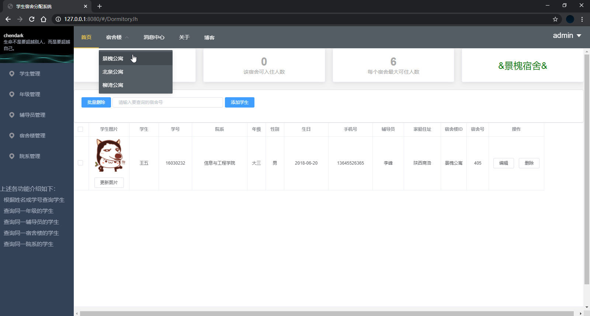

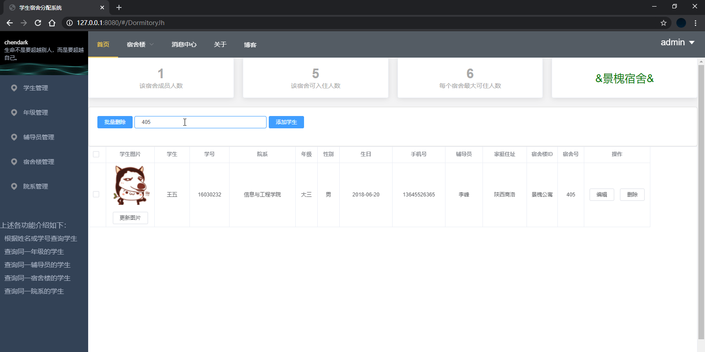

## 北泉公寓
修改**src ->pages -> DormitoryBqPage.vue**文件，如下所示：

~~~html
<!--    宿舍楼北泉公寓管理页面    -->
<template>
    
 <!--table最小宽度是800px，在css/main.css中定义的-->

      <el-row :gutter="20" class="mgb20">
                  <el-col :span="6">
                      <el-card>
                          

                              

                                  
{{allDMCount}}

                                  
该宿舍成员人数

                              

                          

                      </el-card>
                  </el-col>
                  <el-col :span="6">
                      <el-card>
                          

                              

                                  
{{adviceCount}}

                                  
该宿舍可入住人数

                              

                          

                      </el-card>
                  </el-col>
                  <el-col :span="6">
                      <el-card>
                          

                              

                                  
{{maxCount}}

                                  
每个宿舍最大可住人数

                              

                          

                      </el-card>
                  </el-col>
                  <el-col :span="6">
                      <el-card>
                          

                              

                                  
&北泉宿舍&

                              

                          

                      </el-card>
                  </el-col>
      </el-row>

        

            

                <!--批量删除-->
                <el-button type="primary" size="mini" @click="delAll">批量删除</el-button>
                <!--根据宿舍号查询 - BEGIN -->
                <el-input v-model="select_word" size="mini" placeholder="请输入要查询的宿舍号" class="handle-input"></el-input>
                <!--根据宿舍号查询 - END -->
                <el-button type="primary" size="mini" @click="centerDialogVisible = true">添加学生</el-button>
            

        

        <!--查询学生-BEGIN-->
        <el-table size="mini" border style="width:100%" height="500px" :data="data" 
            @selection-change="handleSelectionChange">   <!--要实现列表分页，这里将tableData改为了data-->
           <!-- 添加一个多选框 -->
           <el-table-column type="selection" width="40"></el-table-column>
           
           <!--学生头像显示-->
            <el-table-column label="学生图片" width="110" align="center">
                <template slot-scope="scope">
                    

                        
                    

                    <!--更新学生图片 - BEGIN-->
                    <el-upload :action="uploadUrl(scope.row.id)" :before-upload = "beforeAvatorUpload"
                    :on-success="handleAvatorSuccess">
                    <el-button size="mini">更新图片</el-button>
                    </el-upload>
                    <!--更新学生图片 - END -->
                </template>
            </el-table-column>

            <!--学生姓名显示-->
            <el-table-column prop="name" label="学生" width="80" align="center"></el-table-column>   

            <!--学生学号显示-->
            <el-table-column label="学号" width="90" align="center">
                <template slot-scope="scope">
                    {{scope.row.id}}
                </template>
            </el-table-column> 

            <!--学生所在院系显示-->
            <el-table-column label="院系" width="150" align="center">
                <template slot-scope="scope">
                    {{changeDepartment(scope.row.department_id)}}
                </template>
            </el-table-column>

            <!--学生所在年级显示-->
            <el-table-column label="年级" width="50" align="center">
                <template slot-scope="scope">
                    {{changeGrade(scope.row.grade_id)}}
                </template>
            </el-table-column>

            <!--学生性别显示-->
            <el-table-column label="性别" width="50" align="center">
                <template slot-scope="scope">
                    {{changeSex(scope.row.sex)}}
                </template>
            </el-table-column>
        
            <!--学生生日显示-->
            <el-table-column prop="birth" label="生日" width="120" align="center">
                <template slot-scope="scope">
                {{attachBirth(scope.row.birth)}}
                </template>
            </el-table-column>  

            <!--学生手机号显示-->
            <el-table-column label="手机号" width="120" align="center">
                <template slot-scope="scope">
                    {{scope.row.phone_number}}
                </template>
            </el-table-column>  

            <!--学生辅导员工号显示-->
            <el-table-column label="辅导员" width="85" align="center">
                <template slot-scope="scope">
                    {{changeInstructor(scope.row.instructor_id)}}
                </template>
            </el-table-column>

            <!--学生家挺住址显示-->
            <el-table-column prop="location" label="家挺住址" width="100" align="center"></el-table-column>    

            <!--学生所在宿舍楼ID显示-->
            <el-table-column label="宿舍楼ID" width="70" align="center">
                <template slot-scope="scope">
                    {{changeFloor(scope.row.floor_id)}}
                </template>
            </el-table-column>   

            <!--学生所在宿舍号显示-->
            <el-table-column label="宿舍号" width="60" align="center">
                <template slot-scope="scope">
                    {{scope.row.dormitory_id}}
                </template>
            </el-table-column>  

            <!--修改学生 -BEGIN-->
            <el-table-column label="操作" width="150" align="center">
                <template slot-scope="scope">
                    <el-button size="mini" @click="handleEdit(scope.row)">编辑</el-button>
                    <!-- 删除学生 -->
                    <el-button size="mini" @click="handleDelete(scope.row.id)">删除</el-button>
                </template>
            </el-table-column>
            <!--修改学生 -END-->
        </el-table>
         <!--查询学生-END-->

         <!--分页 - BEGIN-->
        

            <el-pagination
                background
                layout = "total,prev,pager,next"
                :current-page="currentPage"
                :page-size="pageSize"
                :total="tableData.length"
                @current-change="handleCurrentChange">
            </el-pagination>
        

         <!--分页 - END-->

        <el-dialog title="添加学生" :visible.sync="centerDialogVisible" width="400px" center>
            <el-form :model="registerForm" ref="registerForm" label-width="80px">

                <el-form-item prop="name" label="学生名：" size="mini">
                    <el-input v-model="registerForm.name" placeholder="学生名"></el-input>
                </el-form-item>

                <el-form-item prop="id" label="学号：" size="mini">
                    <el-input v-model="registerForm.id" placeholder="学号"></el-input>
                </el-form-item>

                <el-form-item label="院系：" size="mini">
                    <el-radio-group v-model="registerForm.department_id">
                        <el-radio :label="0">SE</el-radio>
                        <el-radio :label="1">BS</el-radio>
                        <el-radio :label="2">GE</el-radio>
                        <el-radio :label="3">DC</el-radio>
                    </el-radio-group>
                </el-form-item>

                <el-form-item prop="grade_id" label="年级：" size="mini">
                    <el-input v-model="registerForm.grade_id" placeholder="年级"></el-input>
                </el-form-item>

                <el-form-item label="性别：" size="mini">
                    <el-radio-group v-model="registerForm.sex">
                        <el-radio :label="0">女</el-radio>
                        <el-radio :label="1">男</el-radio>
                        <el-radio :label="2">组合</el-radio>
                        <el-radio :label="3">不明</el-radio>
                    </el-radio-group>
                </el-form-item>

                <el-form-item prop="birth" label="生日：" size="mini">
                    <el-date-picker type="date" v-model="registerForm.birth" placeholder="选择日期" style="width:100%"></el-date-picker>
                </el-form-item>

                <el-form-item prop="location" label="住址：" size="mini">
                    <el-input v-model="registerForm.location" placeholder="家挺住址"></el-input>
                </el-form-item>

                 <el-form-item prop="phone_number" label="手机号：" size="mini">
                    <el-input v-model="registerForm.phone_number" placeholder="手机号"></el-input>
                </el-form-item>

                 <el-form-item prop="instructor_id" label="导员ID：" size="mini">
                    <el-input v-model="registerForm.instructor_id" placeholder="辅导员ID"></el-input>
                </el-form-item>

                <el-form-item prop="floor_id" label="宿舍楼：" size="mini">
                    <el-input v-model="registerForm.floor_id" placeholder="宿舍楼"></el-input>
                </el-form-item>

                <el-form-item prop="dormitory_id" label="宿舍号：" size="mini">
                    <el-input v-model="registerForm.dormitory_id" placeholder="宿舍号"></el-input>
                </el-form-item>
            </el-form>
            
                <el-button size="mini" @click="centerDialogVisible = false">取消</el-button>
                <el-button size="mini" @click="addstudent">确定</el-button>
            
        </el-dialog>

        <el-dialog title="修改学生" :visible.sync="editVisible" width="400px" center>
            <el-form :model="form" ref="registerForm" label-width="80px">

               <el-form-item prop="name" label="学生名：" size="mini">
                    <el-input v-model="form.name" placeholder="学生名"></el-input>
                </el-form-item>

                <el-form-item prop="id" label="学号：" size="mini">
                    <el-input v-model="form.id" placeholder="学号"></el-input>
                </el-form-item>

                <el-form-item label="院系：" size="mini">
                    <el-radio-group v-model="form.department_id">
                        <el-radio :label="0">SE</el-radio>
                        <el-radio :label="1">BS</el-radio>
                        <el-radio :label="2">GE</el-radio>
                        <el-radio :label="3">DC</el-radio>
                    </el-radio-group>
                </el-form-item>

                <el-form-item prop="grade_id" label="年级：" size="mini">
                    <el-input v-model="form.grade_id" placeholder="年级"></el-input>
                </el-form-item>

                <el-form-item label="性别：" size="mini">
                    <el-radio-group v-model="form.sex">
                        <el-radio :label="0">女</el-radio>
                        <el-radio :label="1">男</el-radio>
                        <el-radio :label="2">组合</el-radio>
                        <el-radio :label="3">不明</el-radio>
                    </el-radio-group>
                </el-form-item>

                <el-form-item prop="birth" label="生日：" size="mini">
                    <el-date-picker type="date" v-model="form.birth" placeholder="选择日期" style="width:100%"></el-date-picker>
                </el-form-item>

                <el-form-item prop="location" label="家挺住址：" size="mini">
                    <el-input v-model="form.location" placeholder="家挺住址"></el-input>
                </el-form-item>

                 <el-form-item prop="phone_number" label="手机号：" size="mini">
                    <el-input v-model="form.phone_number" placeholder="手机号"></el-input>
                </el-form-item>

                <el-form-item prop="instructor_id" label="辅导员ID：" size="mini">
                    <el-input v-model="form.instructor_id" placeholder="辅导员ID"></el-input>
                </el-form-item>

                <el-form-item prop="floor_id" label="宿舍楼：" size="mini">
                    <el-input v-model="form.floor_id" placeholder="宿舍楼"></el-input>
                </el-form-item>

                <el-form-item prop="dormitory_id" label="宿舍号：" size="mini">
                    <el-input v-model="form.dormitory_id" placeholder="宿舍号"></el-input>
                </el-form-item>
            </el-form>
            
                <el-button size="mini" @click="editVisible = false">取消</el-button>
                <el-button size="mini" @click="editSave">确定</el-button>
            
        </el-dialog>

        <el-dialog title="删除学生" :visible.sync="delVisible" width="300px" center>
            

                删除操作是不可逆的，是否确认删除？
            

            
                <el-button size="mini" @click="delVisible = false">取消</el-button>
                <el-button size="mini" @click="deleteRow">确定</el-button>
            
        </el-dialog>
    

</template>

~~~

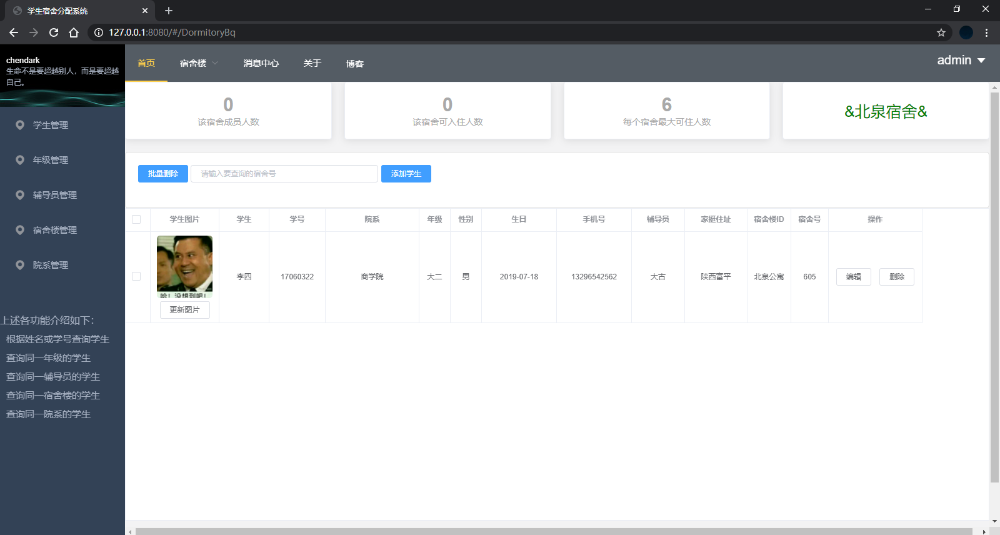

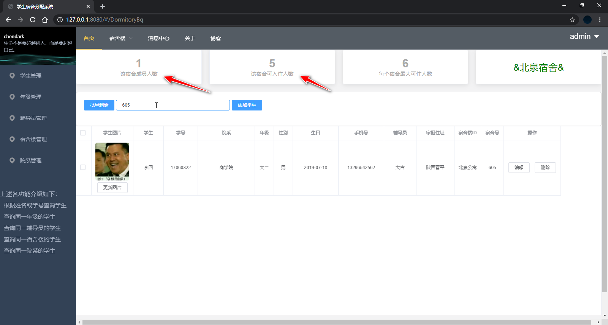

## 柳湾公寓
修改**src ->pages -> DormitoryLwPage.vue**文件，如下所示：

~~~html
<!--    宿舍楼北泉公寓管理页面    -->
<template>
    
 <!--table最小宽度是800px，在css/main.css中定义的-->

      <el-row :gutter="20" class="mgb20">
                  <el-col :span="6">
                      <el-card>
                          

                              

                                  
{{allDMCount}}

                                  
该宿舍成员人数

                              

                          

                      </el-card>
                  </el-col>
                  <el-col :span="6">
                      <el-card>
                          

                              

                                  
{{adviceCount}}

                                  
该宿舍可入住人数

                              

                          

                      </el-card>
                  </el-col>
                  <el-col :span="6">
                      <el-card>
                          

                              

                                  
{{maxCount}}

                                  
每个宿舍最大可住人数

                              

                          

                      </el-card>
                  </el-col>
                  <el-col :span="6">
                      <el-card>
                          

                              

                                  
&柳湾宿舍&

                              

                          

                      </el-card>
                  </el-col>
      </el-row>

        

            

                <!--批量删除-->
                <el-button type="primary" size="mini" @click="delAll">批量删除</el-button>
                <!--根据宿舍号查询 - BEGIN -->
                <el-input v-model="select_word" size="mini" placeholder="请输入要查询的宿舍号" class="handle-input"></el-input>
                <!--根据宿舍号查询 - END -->
                <el-button id="add_main" type="primary" size="mini" @click="centerDialogVisible = true">添加学生</el-button>
            

        

        <!--查询学生-BEGIN-->
        <el-table size="mini" border style="width:100%" height="500px" :data="data" 
            @selection-change="handleSelectionChange">   <!--要实现列表分页，这里将tableData改为了data-->
           <!-- 添加一个多选框 -->
           <el-table-column type="selection" width="40"></el-table-column>
           
           <!--学生头像显示-->
            <el-table-column label="学生图片" width="110" align="center">
                <template slot-scope="scope">
                    

                        
                    

                    <!--更新学生图片 - BEGIN-->
                    <el-upload :action="uploadUrl(scope.row.id)" :before-upload = "beforeAvatorUpload"
                    :on-success="handleAvatorSuccess">
                    <el-button size="mini">更新图片</el-button>
                    </el-upload>
                    <!--更新学生图片 - END -->
                </template>
            </el-table-column>

            <!--学生姓名显示-->
            <el-table-column prop="name" label="学生" width="80" align="center"></el-table-column>   

            <!--学生学号显示-->
            <el-table-column label="学号" width="90" align="center">
                <template slot-scope="scope">
                    {{scope.row.id}}
                </template>
            </el-table-column> 

            <!--学生所在院系显示-->
            <el-table-column label="院系" width="150" align="center">
                <template slot-scope="scope">
                    {{changeDepartment(scope.row.department_id)}}
                </template>
            </el-table-column>

            <!--学生所在年级显示-->
            <el-table-column label="年级" width="50" align="center">
                <template slot-scope="scope">
                    {{changeGrade(scope.row.grade_id)}}
                </template>
            </el-table-column>

            <!--学生性别显示-->
            <el-table-column label="性别" width="50" align="center">
                <template slot-scope="scope">
                    {{changeSex(scope.row.sex)}}
                </template>
            </el-table-column>
        
            <!--学生生日显示-->
            <el-table-column prop="birth" label="生日" width="120" align="center">
                <template slot-scope="scope">
                {{attachBirth(scope.row.birth)}}
                </template>
            </el-table-column>  

            <!--学生手机号显示-->
            <el-table-column label="手机号" width="120" align="center">
                <template slot-scope="scope">
                    {{scope.row.phone_number}}
                </template>
            </el-table-column>  

            <!--学生辅导员工号显示-->
            <el-table-column label="辅导员" width="85" align="center">
                <template slot-scope="scope">
                    {{changeInstructor(scope.row.instructor_id)}}
                </template>
            </el-table-column>

            <!--学生家挺住址显示-->
            <el-table-column prop="location" label="家挺住址" width="100" align="center"></el-table-column>    

            <!--学生所在宿舍楼ID显示-->
            <el-table-column label="宿舍楼ID" width="70" align="center">
                <template slot-scope="scope">
                    {{changeFloor(scope.row.floor_id)}}
                </template>
            </el-table-column>   

            <!--学生所在宿舍号显示-->
            <el-table-column label="宿舍号" width="60" align="center">
                <template slot-scope="scope">
                    {{scope.row.dormitory_id}}
                </template>
            </el-table-column>  

            <!--修改学生 -BEGIN-->
            <el-table-column label="操作" width="150" align="center">
                <template slot-scope="scope">
                    <el-button size="mini" @click="handleEdit(scope.row)">编辑</el-button>
                    <!-- 删除学生 -->
                    <el-button size="mini" @click="handleDelete(scope.row.id)">删除</el-button>
                </template>
            </el-table-column>
            <!--修改学生 -END-->
        </el-table>
         <!--查询学生-END-->

         <!--分页 - BEGIN-->
        

            <el-pagination
                background
                layout = "total,prev,pager,next"
                :current-page="currentPage"
                :page-size="pageSize"
                :total="tableData.length"
                @current-change="handleCurrentChange">
            </el-pagination>
        

         <!--分页 - END-->

        <el-dialog title="添加学生" :visible.sync="centerDialogVisible" width="400px" center>
            <el-form :model="registerForm" ref="registerForm" label-width="80px">

                <el-form-item prop="name" label="学生名：" size="mini">
                    <el-input v-model="registerForm.name" placeholder="学生名"></el-input>
                </el-form-item>

                <el-form-item prop="id" label="学号：" size="mini">
                    <el-input v-model="registerForm.id" placeholder="学号"></el-input>
                </el-form-item>

                <el-form-item label="院系：" size="mini">
                    <el-radio-group v-model="registerForm.department_id">
                        <el-radio :label="0">SE</el-radio>
                        <el-radio :label="1">BS</el-radio>
                        <el-radio :label="2">GE</el-radio>
                        <el-radio :label="3">DC</el-radio>
                    </el-radio-group>
                </el-form-item>

                <el-form-item prop="grade_id" label="年级：" size="mini">
                    <el-input v-model="registerForm.grade_id" placeholder="年级"></el-input>
                </el-form-item>

                <el-form-item label="性别：" size="mini">
                    <el-radio-group v-model="registerForm.sex">
                        <el-radio :label="0">女</el-radio>
                        <el-radio :label="1">男</el-radio>
                        <el-radio :label="2">组合</el-radio>
                        <el-radio :label="3">不明</el-radio>
                    </el-radio-group>
                </el-form-item>

                <el-form-item prop="birth" label="生日：" size="mini">
                    <el-date-picker type="date" v-model="registerForm.birth" placeholder="选择日期" style="width:100%"></el-date-picker>
                </el-form-item>

                <el-form-item prop="location" label="住址：" size="mini">
                    <el-input v-model="registerForm.location" placeholder="家挺住址"></el-input>
                </el-form-item>

                 <el-form-item prop="phone_number" label="手机号：" size="mini">
                    <el-input v-model="registerForm.phone_number" placeholder="手机号"></el-input>
                </el-form-item>

                 <el-form-item prop="instructor_id" label="导员ID：" size="mini">
                    <el-input v-model="registerForm.instructor_id" placeholder="辅导员ID"></el-input>
                </el-form-item>

                <el-form-item prop="floor_id" label="宿舍楼：" size="mini">
                    <el-input v-model="registerForm.floor_id" placeholder="宿舍楼"></el-input>
                </el-form-item>

                <el-form-item prop="dormitory_id" label="宿舍号：" size="mini">
                    <el-input v-model="registerForm.dormitory_id" placeholder="宿舍号"></el-input>
                </el-form-item>
            </el-form>
            
                <el-button size="mini" @click="centerDialogVisible = false">取消</el-button>
                <el-button size="mini" @click="addstudent">确定</el-button>
            
        </el-dialog>

        <el-dialog title="修改学生" :visible.sync="editVisible" width="400px" center>
            <el-form :model="form" ref="registerForm" label-width="80px">

               <el-form-item prop="name" label="学生名：" size="mini">
                    <el-input v-model="form.name" placeholder="学生名"></el-input>
                </el-form-item>

                <el-form-item prop="id" label="学号：" size="mini">
                    <el-input v-model="form.id" placeholder="学号"></el-input>
                </el-form-item>

                <el-form-item label="院系：" size="mini">
                    <el-radio-group v-model="form.department_id">
                        <el-radio :label="0">SE</el-radio>
                        <el-radio :label="1">BS</el-radio>
                        <el-radio :label="2">GE</el-radio>
                        <el-radio :label="3">DC</el-radio>
                    </el-radio-group>
                </el-form-item>

                <el-form-item prop="grade_id" label="年级：" size="mini">
                    <el-input v-model="form.grade_id" placeholder="年级"></el-input>
                </el-form-item>

                <el-form-item label="性别：" size="mini">
                    <el-radio-group v-model="form.sex">
                        <el-radio :label="0">女</el-radio>
                        <el-radio :label="1">男</el-radio>
                        <el-radio :label="2">组合</el-radio>
                        <el-radio :label="3">不明</el-radio>
                    </el-radio-group>
                </el-form-item>

                <el-form-item prop="birth" label="生日：" size="mini">
                    <el-date-picker type="date" v-model="form.birth" placeholder="选择日期" style="width:100%"></el-date-picker>
                </el-form-item>

                <el-form-item prop="location" label="家挺住址：" size="mini">
                    <el-input v-model="form.location" placeholder="家挺住址"></el-input>
                </el-form-item>

                 <el-form-item prop="phone_number" label="手机号：" size="mini">
                    <el-input v-model="form.phone_number" placeholder="手机号"></el-input>
                </el-form-item>

                <el-form-item prop="instructor_id" label="辅导员ID：" size="mini">
                    <el-input v-model="form.instructor_id" placeholder="辅导员ID"></el-input>
                </el-form-item>

                <el-form-item prop="floor_id" label="宿舍楼：" size="mini">
                    <el-input v-model="form.floor_id" placeholder="宿舍楼"></el-input>
                </el-form-item>

                <el-form-item prop="dormitory_id" label="宿舍号：" size="mini">
                    <el-input v-model="form.dormitory_id" placeholder="宿舍号"></el-input>
                </el-form-item>
            </el-form>
            
                <el-button size="mini" @click="editVisible = false">取消</el-button>
                <el-button size="mini" @click="editSave">确定</el-button>
            
        </el-dialog>

        <el-dialog title="删除学生" :visible.sync="delVisible" width="300px" center>
            

                删除操作是不可逆的，是否确认删除？
            

            
                <el-button size="mini" @click="delVisible = false">取消</el-button>
                <el-button size="mini" @click="deleteRow">确定</el-button>
            
        </el-dialog>
    

</template>

~~~

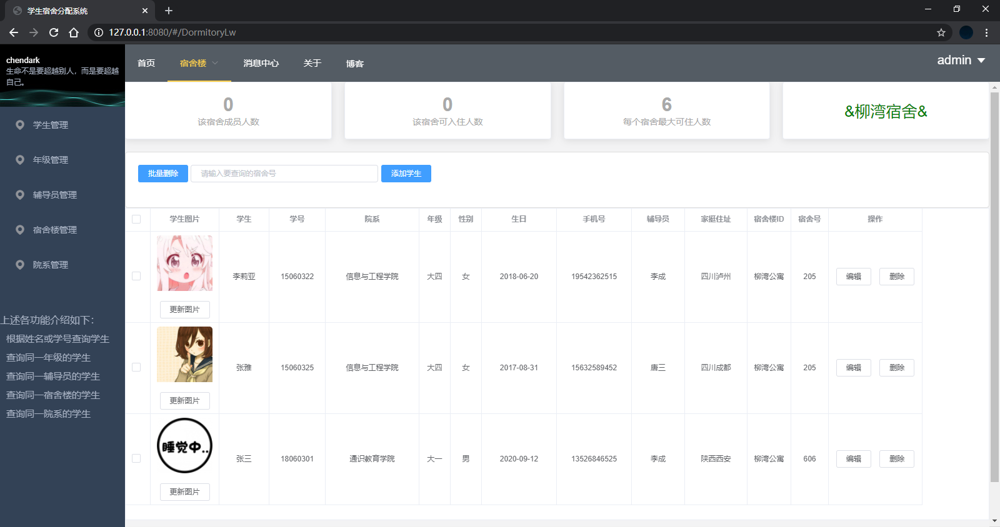

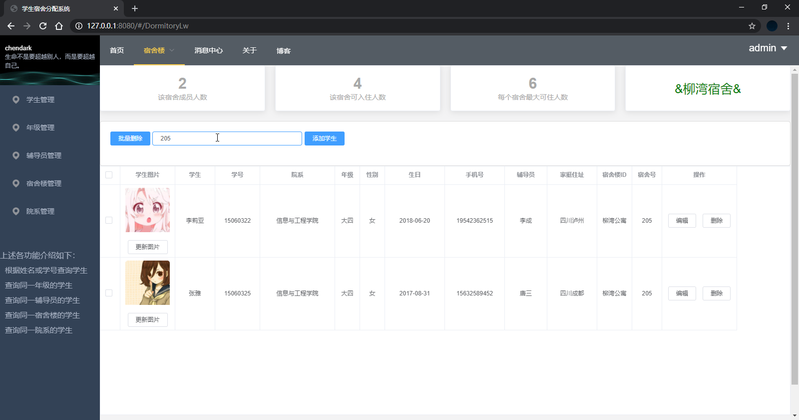

# 消息中心页面
修改**src -> components -> NewsPage.vue**文件，如下所示：

~~~html
<template>
  

      <h1>引入一个评论系统，比如博客中用的Valine评论系统！</h1>
      

        
      

  

</template>

~~~

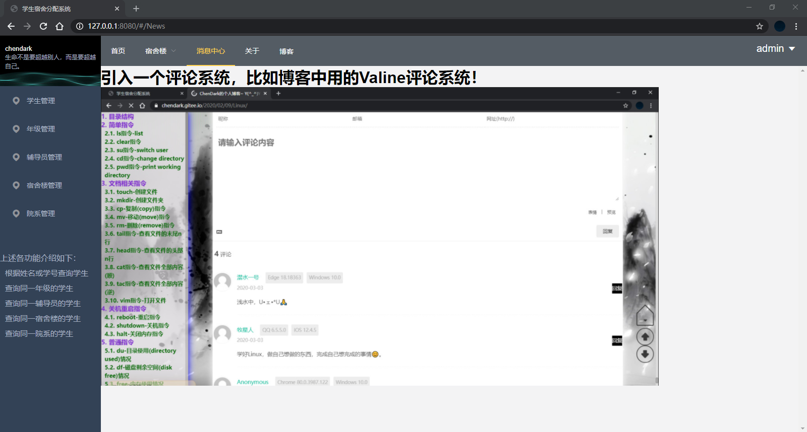

# About页面
修改**src -> pages -> AboutPage.vue**，如下所示：

~~~html
<template>
  

      

          

              关于
          

          

              

学生宿舍分配系统

               
              
辅导员4个(不想是固定的4个辅导员可将辅导员信息从instructor_id改为instructor_name)：

              

                工号1：李峰 
                工号2：李成 
                工号3：唐三 
                工号4：大古  
              
 
          
 
           

              
宿舍楼3个：

              

                编号1：景槐公寓 
                编号2：北泉公寓 
                编号3：柳湾公寓 
              
 
          

          

              
学院4个：

              

                编号0：信息与工程学院 -SE 
                编号1：商学院 -BS 
                编号2：通识教育学院 -GE 
                编号3：设计与创意学院 -DC 
              
 
          
            
      

  

</template>

~~~

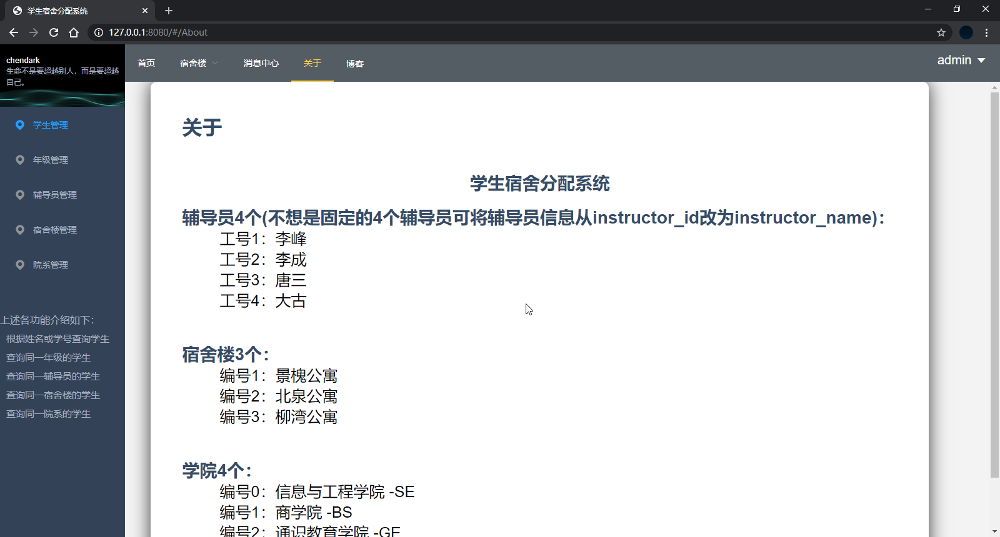

# 添加网站管理用户
1.修改**controller -> AdminController.java**文件，如下所示：

~~~java
package com.chen.sdds.controller;
import com.alibaba.fastjson.JSONObject;
import com.chen.sdds.domain.Admin;
import com.chen.sdds.domain.Student;
import com.chen.sdds.service.AdminService;
import com.chen.sdds.utils.Consts;
import org.springframework.beans.factory.annotation.Autowired;
import org.springframework.web.bind.annotation.RequestMapping;
import org.springframework.web.bind.annotation.RequestMethod;
import org.springframework.web.bind.annotation.RestController;

import javax.servlet.http.HttpServletRequest;
import javax.servlet.http.HttpSession;

/*
 *控制层
 */
@RestController
public class AdminController {
    @Autowired
    private AdminService adminService;

    /*
     * 判断是否登录成功
     * */
    @RequestMapping(value = "/admin/login/status",method = RequestMethod.POST)
    public Object loginStatus(HttpServletRequest request, HttpSession session){
        JSONObject jsonObject = new JSONObject();
        String name = request.getParameter("name");
        String password = request.getParameter("password");
        boolean flag = adminService.verifyPassword(name,password);
        if (flag){
            jsonObject.put(Consts.CODE,1);
            jsonObject.put("msg","登录成功");
            session.setAttribute(Consts.NAME,name);
            return jsonObject;
        }
        jsonObject.put(Consts.CODE,0);
        jsonObject.put("msg","用户名或密码错误");
        return jsonObject;
    }

    /*
     * 查询所有网站管理员数据
     * */
    @RequestMapping(value = "/admin/getAllAdmin",method = RequestMethod.GET)
    public Object getAllAdmin(HttpServletRequest request) {
        return adminService.getAllAdmin();
    }

    /*
     * 添加网站管理员
     */
    @RequestMapping(value = "/admin/addUser",method = RequestMethod.POST)
    public Object addAdmin(HttpServletRequest request) {
        JSONObject jsonObject = new JSONObject();
        String name =request.getParameter("name").trim();   //用户名
        String password =request.getParameter("password").trim();   //用户名

        System.out.println(name);
        System.out.println(password);
        //将内容保存到学生对象中
        Admin admin = new Admin();

        //判断是否保存成功
        boolean flag = adminService.insert(admin);
        if (flag){  //保存成功
            jsonObject.put(Consts.CODE,1);
            jsonObject.put(Consts.MSG,"添加成功！");
            return jsonObject;
        }
        //保存失败
        jsonObject.put(Consts.CODE,0);
        jsonObject.put(Consts.MSG,"添加失败！");
        return jsonObject;
    }

}

~~~

2.修改**dao -> AdminMapper.java**文件，如下所示：

~~~java
package com.chen.sdds.dao;
import com.chen.sdds.domain.Admin;
import org.springframework.stereotype.Repository;

import java.util.List;

/*
 * 管理员Dao，数据访问层
 * */
@Repository
public interface AdminMapper {
    /*
     * 验证密码是否正确
     * */
    int verifyPassword(String username, String password);

    /*
     * 查询所有网站管理员数据
     * */
    public List<Admin> getAllAdmin();

    /*
     * 增加
     * */
    public int insert(Admin admin);
}

~~~

3.修改**service -> AdminService.java**文件，如下所示：

~~~java
package com.chen.sdds.service;

import com.chen.sdds.domain.Admin;

import java.util.List;

/*
 * 管理员service接口，业务层
 * */
public interface AdminService {
    /*
     * 验证密码是否正确
     * */
    public boolean verifyPassword(String username,String password);

    /*
     * 查询所有网站管理员数据
     * */
    public List<Admin> getAllAdmin();

    /*
     * 增加
     * */
    public boolean insert(Admin admin);
}
~~~

4.修改**service -> impl -> AdminServiceImpl.java**文件，如下所示：

~~~java
package com.chen.sdds.service.impl;
import com.chen.sdds.dao.AdminMapper;
import com.chen.sdds.domain.Admin;
import com.chen.sdds.service.AdminService;
import org.springframework.beans.factory.annotation.Autowired;
import org.springframework.stereotype.Service;

import java.util.List;

/*
 * 管理员service实现类
 * */
@Service
public class AdminServiceImpl implements AdminService {

    @Autowired
    private AdminMapper adminMapper;
    /*
     * 验证密码是否正确
     * */
    @Override
    public boolean verifyPassword(String username, String password) {
        return adminMapper.verifyPassword(username,password)>0; //大于0则返回True
    }

    /*
     * 查询所有网站管理员数据
     * */
    @Override
    public List<Admin> getAllAdmin() {
        return adminMapper. getAllAdmin();
    }

    /*
     * 增加
     * */
    @Override
    public boolean insert(Admin admin) {
        return adminMapper.insert(admin) > 0;
    }
}
~~~

5.修改**resources -> mapper -> AdminMapper.xml**文件，如下所示:

~~~java
<?xml version="1.0" encoding="UTF-8"?>
<!DOCTYPE mapper PUBLIC
        "-//mybatis.org//DTD Mapper 3.0//EN"
        "http://mybatis.org/dtd/mybatis-3-mapper.dtd">
<mapper namespace="com.chen.sdds.dao.AdminMapper">
    <resultMap id="BaseResultMap" type="com.chen.sdds.domain.Admin" >
        <id column="id" jdbcType="INTEGER" property="id"/>
        <result column="name" jdbcType="VARCHAR" property="name"/>
        <result column="password" jdbcType="VARCHAR" property="password"/>
    </resultMap>

    <sql id="Base_Column_List">
        id,name,password
    </sql>

    <select id="verifyPassword" resultType="java.lang.Integer">
        select count(*) from admin where name=#{username} and password=#{password}
    </select>

    <!--- 查询所有网站管理员数据-Begin -->
    <select id="getAllAdmin" resultMap="BaseResultMap">
        select
        <include refid="Base_Column_List"/>
        from admin
    </select>
    <!--- 查询所有网站管理员数据-End -->

    <!-- 增加-Begin -->
    <insert id="insert" parameterType="com.chen.sdds.domain.Admin">
        insert into admin
        <trim prefix="(" suffix=")" suffixOverrides=","> <!--查询结果加上“()”，并且后面去掉“,”-->
            <if test="name != null">
                name,
            </if>
            <if test="password != null">
                password,
            </if>
        </trim>
        <trim prefix="values (" suffix=")" suffixOverrides=",">
            <if test="name != null">
                #{name},
            </if>
            <if test="password != null">
                #{password},
            </if>
        </trim>
    </insert>
    <!-- 增加-End -->
</mapper>
~~~

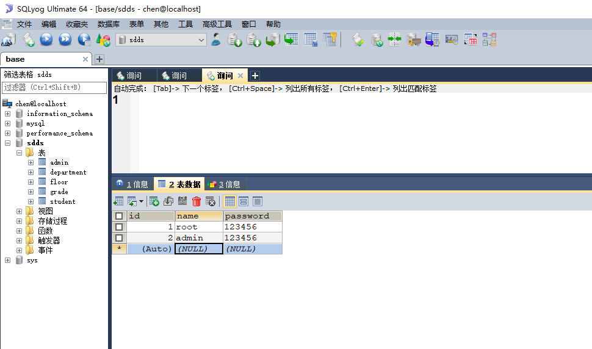

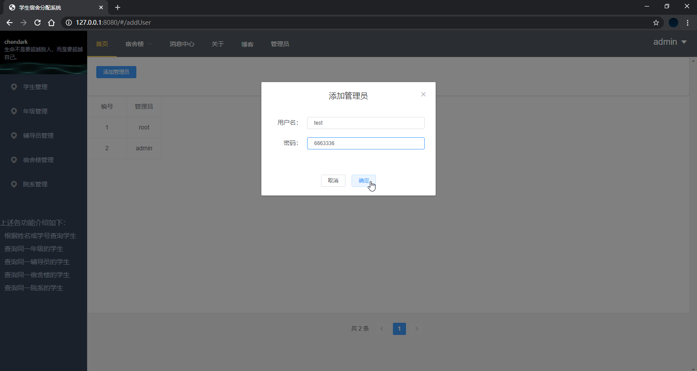

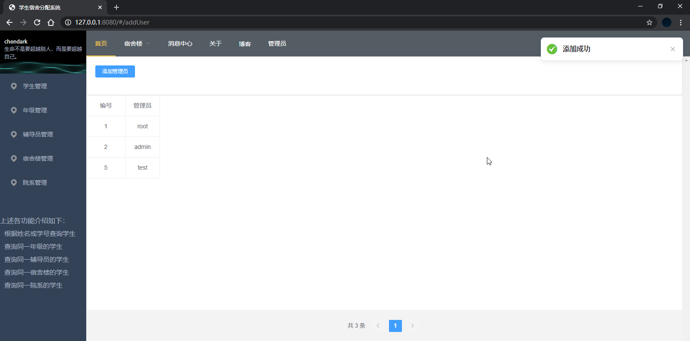

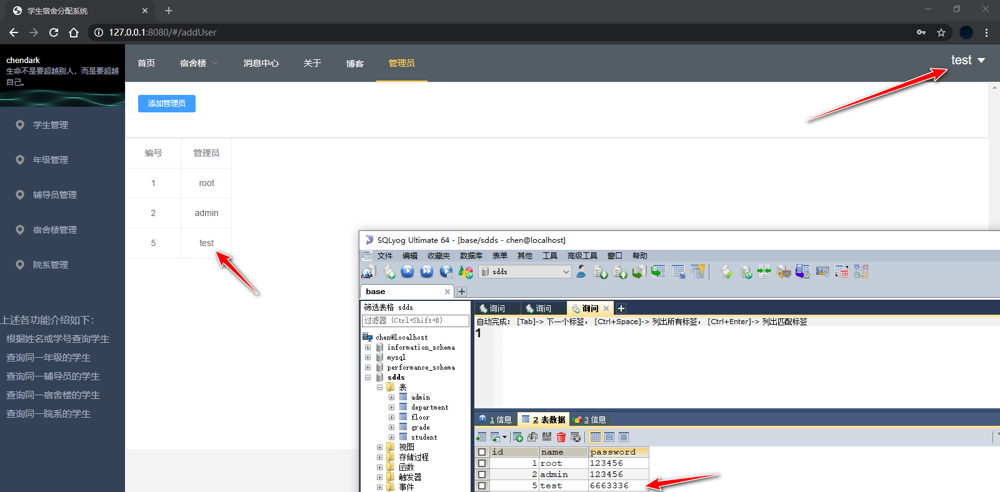

# End

有很多不足的地方，最后想要修改工作量变得很大，也就不改了，做一个东西的时候还是要花时间放在最开始的设计阶段，只有开头设计好了后面才能轻轻松松。

